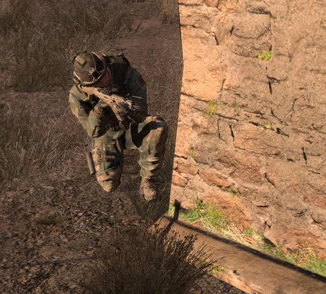

# Базові навики піхотинця

## The Basic Rifleman

As a rifleman, you are the most fundamental element of our combat power. The proficiency you demonstrate is a key factor in the survival of yourself, your fireteam, your squad, and ultimately the entire platoon. Every person plays a role in the bigger picture, and we are only as strong as our weakest link. Our aim is to make even our weakest link into a skilled player.

To this end, every player must be proficient and familiar with the role of a basic rifleman first and foremost. While you may want to fly planes and helos or drive tanks, it is important that you build upon a strong foundation of basic rifleman skills and are intimately familiar with "life as an Arma 3 infantryman" if you hope to effectively use such vehicles in the future. All vehicles are oriented around supporting the infantry, and the only way you can be truly effective at this is to know what it's like to be an infantryman to begin with.

To help you fulfill your role and contribute to the success of our missions, we'll now cover the "Basic Rifleman Skills & Knowledge". This should give you a solid baseline of knowledge that will keep you alive long enough to learn the finer points through virtual combat experience.


## Fireteams

### About the Fireteam & Your Role In It

Fireteams are the most fundamental combat elements of our platoon structure. You will learn much more about them (and everything else about our structure) in the "Platoon" section later on - for now, we will cover the basic premise behind them.

Each fireteam consists of six players: a leader and five subordinates. As a new player, you will end up acting as a rifleman in one of the six different fireteams in our standard platoon. As the rifleman, you will be under charge of a more experienced player, acting as the fireteam leader. He, in turn, will be under the command of a squad leader who leads the two fireteams that make up each squad. Likewise, the squad leader will be under the command of the Platoon Commander, who commands the three squads that form the platoon - who is in turn led by the Company Commander, who directs the movements of the platoons.


### Working as a Team

The key aspect of our organization is that of closely-knit teams - a rifleman by themself is not nearly as useful as a group of six players working as one cohesive unit. Fireteams look out for their own members as well as those of their fellow fireteams. Fireteams are the tip of the infantry spear.

Note that there are no "set" fireteams in ShackTac, nor should you expect them on most public Arma servers. You will find yourself grouped with different players in different missions, and your comprehension of this guide is what will allow you to all act as a cohesive and combat-effective group, regardless of who exactly is in your fireteam.


### Basic Responsibilities of a Fireteam Member

In order to play at the highest possible level of coordination, teamwork, and effectiveness, there are many things that each player must be familiar with. This entire guide is an example of those sorts of topics. The key foundational aspects of this are in the "basic responsibilities" of each fireteam member, and by association, every player in the platoon or company. In order to maintain cohesion and combat effectiveness, every player in our community is expected to abide by these simple ground rules.


#### As a fireteam member, you must...

- **Know your squad and fireteam.** With our structure, squads are lettered and fireteams numbered. Remember what team and squad you are in, as this allows you to pick out, confirm, and act upon voice orders relevant to you. Make sure you are familiar with your fireteam leader's voice, as well as that of your buddy team member(s). You can find out what group/team you are in via the map screen - the top-right will list your current group.
- **Listen to your team leader and follow their directions.** Fireteam and Squad Leaders are typically the more experienced players. Their role is to try to keep you alive and in the fight, while accomplishing whatever mission the squad may be tasked with. Listen to them and stick with your team.
- **Practice fire discipline and know the Rules Of Engagement (ROE), described in detail shortly.** Do not be the one to give away a stealthy approach by accidentally firing your rifle or firing at a target without having been given clearance. Once things heat up, and the element of surprise is lost, you're usually free to shoot at anything that poses a threat. Until then, maintain good fire discipline, in accordance with the instructions of your element leader.
- **Maintain appropriate interval.** Bunching up gets people killed. Keep several meters of distance between yourself and other players at all times. If not, a grenade, rocket, or machinegun is going to have a fun time with you and those you have clustered with.


- **Maintain situational awareness, avoid tunnel vision, and know where friendly forces are.** This all helps to prevent being surprised by enemy contacts, prevents friendly-fire incidents, and gives you an idea of what areas may need more observation based upon how the squad or platoon is oriented. More on this in the "Situational Awareness" section, later.
- **Cover your sector.** 360° security is needed at all times. This means that with a fireteam of six, every person should be observing or covering a different area. Good security means that your team is that much less likely to be surprised by the enemy, and thus is going to survive longer in combat. When halted, ensure that somebody is paying attention to rear security as well. If nobody else is, take it upon yourself to do so - your team will thank you later.
- **Scan for, spot, and call out enemy contacts.** Do it concisely via voice so that everyone can hear you. When giving the direction of contacts, relative directions (front, left, rear, right) can be used when friendly forces are moving in a known direction and front, rear, right, left are known to everyone. Otherwise, compass directions and degree bearings should be used. More on this in the "Contact Report" section later on.
- **Know your target.** Don't wildly shoot at everything that moves, as that tends to cause friendly fire casualties. If in doubt, don't shoot. Ask someone else in your fireteam to check out the questionable contact. Check the map to see if friendly forces are where you're looking. If you're still unsure, ask the element leader and they can take it up the chain of command if necessary. Once you pull the trigger, there's nothing you can do to bring that round back. Don't be the one to shoot a friendly through carelessness!
- **Be concise on comms.** Learn how to speak with brevity on voice channels to avoid cluttering them up when they're most needed.
- **Avoid crossing lines and lanes of fire.** If you need to move past a person, always try to pass behind them. If you ever do need to move in front of someone in a combat situation, ensure that you call them by name and tell them that you're about to cross their line of fire. Obviously common sense will dictate when this is necessary. Crossing in front of someone during general movement towards an objective is not a huge deal and does not merit a call, whereas running in front of someone during a firefight can get you killed and requires coordination with whoever you need to cross in front of.


- **Always work as part of a buddy team.** More info in the "Buddy Team" section next.

All of these topics are covered in more depth throughout this guide, so if you're not 100% sure on any of them, all should be explained by the time you're through with this.

## Buddy Teams

The buddy team concept ensures that every person has at least one other person looking out for them at all times. It simply means that you always move with, watch out for, and fight with at least one other person at your side. Buddy teams are standardized in the platoon, though fireteam leads can choose to change the groupings as the situation dictates.

The standard buddy teams are set up as follows: the Fireteam Leader is by themself, while the first two members of the fireteam - typically the Automatic Rifleman and Assistant (known as the AR/AAR pair) - are grouped together. The last three members - either another AR/AAR pair, or three riflemen or riflemen AT - are the second buddy team. The fireteam leader is generally treated as if a member of the AR/AAR buddy team, though the requirements of their leadership often mean that they're having to move between the two buddy teams to check lanes of fire and similar.

The first buddy team - AR/AAR combo - is usually the heavier-hitting of the two, due to them employing the fireteam's automatic rifle. The Fireteam Leader will keep them nearby and assign them positions and sectors of fire as the fighting develops. The second team may or may not have an automatic rifle, and is typically where you as a newer player will find yourself.

Note that if you are using the [ShackTac Fireteam HUD](http://dslyecxi.com/shacktac-fireteam-hud-for-arma-3/), and the Fireteam Leader is using it properly, you will see the buddy teams given color-codes such that they easily stick out on the HUD. More on this later in the Fireteam section.

#### Your basic responsibilities to your buddy teammate(s) are...

- **Stick with your buddies.** When they move, you should be with them. Together you are far more effective than apart.


- **Communicate with your buddies.** If it's important, let them know. If you're moving, say so, so that they can know to cover you. Good communication keeps everyone working together and aware of each other's status.
- **Cover your buddies. Cue off of your buddy's movement, sector of observation, and so forth.** If they're watching one way, cover the other. If they're going to cross a danger area (such as a street), cover them as they move.
- **Maintain accountability of your buddy.** When you change positions, make sure they come with you - leaving a wounded buddy behind in haste is an unpleasant realization to have.
- **Pull your buddy out of the fight if they go down.** If you are incapacitated, you can count on your buddy to come to your aid. Likewise, if your buddy is incapacitated, you know to step forward and do your part to save them, or contribute towards someone else, such as the medic, saving them. This may entail dragging them out of a danger area, carrying them to a medic, using smoke to conceal their position, or simply killing whoever tried to kill them. **Remember that you are no good to them dead** - if the tactical situation does not allow you to immediately help them, your task is to help make the situation more favorable - typically accomplished by killing the enemy, or coordinating with others to help kill or suppress the enemy. If your buddy is hit, a rapid assessment must be made as to whether they are dead or wounded, and whether the situation allows for you to safely pull them to cover. A dead teammate can wait, whereas a wounded one may need immediate attention from a medic and your action may be the deciding factor between life and death. If your buddy goes down, call out to the other fireteam buddy team and get them to cover you while you drag them to safety. Once you've made it to cover, call out to the squad medic and ensure that your buddy is treated. Depending on the tactical situation, you may want to stay to provide security for the medic, or move back to the fireteam and continue fighting.

Living by these guidelines is a key factor of success in battle. Learn them, know them, and be sure to always practice them.

## Situational Awareness

One of the most fundamental combat survival skills is that of situational awareness. This simply means that you are alert to your surrounding environment and can leverage your knowledge of the battlefield's state to make tactical decisions and judgment calls.

**Maintaining good situational awareness is key to preventing friendly casualties.** Proper situational awareness will allow you to spot the enemy before they spot you, detect an ambush before it is sprung, and notice unusual characteristics of the environment that may betray the presence of mines, booby traps, enemy vehicles, fortifications, and more. **It is the responsibility of every member of the unit to maintain a high state of situational awareness at all times.**

To develop and maintain that situational awareness, heed the following.

### Basic Situational Awareness Guidelines

- **Whether you're moving or halted, you should always be scanning for the enemy.** Murphy's Laws of Combat tell you that the moment you let your guard down and stop scanning is the moment the enemy will appear.
- **Cover whatever areas you have been assigned to, or cover whatever area seems to need coverage.** Adapt to the situation as needed, and be able to pick out areas that may be more dangerous, and warrant more observation, than others.
- **When you're halted, take a knee, find cover if possible, and continue to scan.**
- **Stay alert! There is no "safe" time in a combat zone.** If you let your guard down, either you will die from it, or, worse, you will get a teammate killed because of it. Getting yourself shot is one thing, but getting a teammate shot is something else best avoided.
- **Be aware of the risks of "tunnel vision", and avoid falling into that state.** Tunnel vision occurs when a player gets so fixated on a specific target, object, or area that they neglect to stay aware of the "big picture". Remember that for every enemy you see, there are probably three or four (or more) others that you do not. Fixating on a single enemy at the expense of everything else is likely to get you flanked and killed. Stay alert and aware, and you will greatly increase your odds of survival.
- **Check the map frequently to maintain awareness of friendly positions, suspected enemy locations, and more.** The map can be used to mark enemy contacts as well as friendly positions, and some mission types (or mods) allow you to see friendly forces on the map. Ensure that you check it frequently to keep up-to-date on suspected enemy positions, as well as friendly positions.

The rest of this section will detail additional situational awareness considerations, tips, and guidelines that should help give you the best chance of surviving your virtual combat experiences.

### What to Stay Aware of, Look and Listen For

There are many things that a player must stay aware of (and be on the lookout for) during the course of a mission. Depending on whether combat is ongoing or not, your may find yourself focusing on different aspects of your situational awareness. In light of that, these guidelines are broken down into general, pre-combat, combat, and post-combat tips.

#### General Situational Awareness
Keep these in mind at all times, regardless of whether combat is actively occurring or not.

- **Where are friendly forces located?** Knowing this will help you to pick which areas to spend your time observing, and will help to prevent friendly fire. This includes knowing where your own fireteam members are, where your squad's fireteams are, as well as where other squads in the platoon are located.
- **Where is the enemy most likely relative to you? What are the likely positions they will be occupying?** What can you do to minimize your exposure to them?
- **Where is the nearest usable piece of cover or concealment?** This is important to know if you come under fire unexpectedly, or make visual contact with the enemy and must enact a hasty ambush.
- **Where are my teammates watching?** Knowing where friendly units are looking helps you to pick a direction to watch that will complement their observation sectors.


#### Prior to combat, scan the following...

Pay particular attention to these whenever there is the likely threat of enemy contact. If you paid attention earlier, you should be thinking, "but you said to always expect contact, shouldn't I pay attention to these items at all times?" To which I would say yes, you are correct!

- **Bases of trees.** Tree trunks are the most prolific cover available in the great outdoors, and many enemy ambushes will involve soldiers using trees as cover and concealment.
- **Shrubs and bushes, particularly on the edges. Shooting through a bush or from within one isn't always that easy. You'll often find people firing around the sides of a bush.
- **Large rocks, boulders, stone fences, and fallen trees.** All of these provide nice hard cover and tend to attract people to them due to their protective attributes. Note that trees knocked down mid-mission will not provide cover, but those that are placed as part of the environment will.
- **Rooftops, especially near any protrusions such as stairwells.** Protruding stairwells, air vents, etc can be used as cover for anyone using a roof as a firing position.
- **The edges of windows.** You'll hopefully spot anyone blatantly standing in a window, so that means that you should focus your attention on scanning the edges to ensure that no one is 'tucked-in' to the window.
- **The edges of walls, buildings, etc.** Hard cover (such as walls and buildings) is of great appeal to an infantryman, and because of that, it should be given appropriate attention.
- **Knocked-down trees, bushes, fences, etc.** If the enemy has vehicles they may accidentally run down trees, bushes, or other obstacles and give away where they've been. The enemy may also knock down trees and then use them as concealment, or to clear fields of fire when in the defense.
Prominent structures. Snipers, machinegunners, and forward observers tend to head into tall structures when they have an opportunity to do so. Being aware of these structures, and scanning them accordingly, will help to avoid nasty surprises.

#### In combat, look for...

Once contact has been made and fire is being exchanged, start paying attention to these aspects.

- **Muzzle flashes at night, and muzzle smoke during the day.** You may not always see the precise outline of an enemy, but that big puff of smoke and dust in the day or flash of flame at night (or in low light situations) that keeps popping up from the same location over and over again can act as a great indicator to where the enemy is located.
- **Tracers.** Tracers are brilliant neon signs that say "I'm firing from over here!" These are the most visible signs of the enemy, and the easiest to follow back to the shooter's origin. Note that not all weapons will fire tracers.
- **Smoke.** If the enemy fires a heavy weapon such as a rocket propelled grenade (RPG), you'll be able to pick out their position by the large volume of smoke produced by the weapon's backblast. You may also see the enemy using smokescreens to mask their movement. Typically, a cloud of smoke created in such a fashion is a giant "Shoot here!" sign, since it's most likely being used to conceal the enemy's movement. However, keep in mind that the enemy may sometimes employ smoke as a diversion.
- **Dead enemies.** This is particularly useful if contact was made with the enemy by another element, close air support, or artillery. Dead enemy soldiers can give you an idea of where the enemy was, what they were (e.g. special forces, normal troops, etc) and even where they may still be.


#### After combat, look for...

Whether the enemy has fled or been defeated, or after coming upon the scene of dead enemies, keep an eye out for the following.

- **Stragglers or last-stand enemies.** Just because you think you killed them all, doesn't mean that you killed them all. Stay ever-vigilant and check any area where a lone survivor might try to hide to ambush you and your teammates. Clear the area before you start checking bodies.
- **Incapacitated enemies.** In mods with more robust damage simulation, you may come upon enemies who have been knocked unconscious or have passed out from damage. Never assume that a downed person is dead, always check them to be sure.
- **Watch for satchel charges or other explosives that could have been set on a timer or may be command-detonated.** If you see any, immediately announce it to your element leader and vacate the area. Satchel charges can be hidden in grass and can be very hard to pick out. Keep good interval when clearing enemy bodies to avoid a hidden satchel causing multiple casualties. If possible, avoid sending more than one or two people to check out enemy bodies to begin with.
- **Check what weapon systems have been left behind if the enemy retreated.** If they abandoned valuable weapons like RPGs, anti-aircraft missiles, machineguns, crew-served weapons, etc, they are potentially disorganized and a decision can be made as to whether the fleeing enemies should be pursued.

#### Listen!

A sharp ear is often as valuable as a sharp eye, and there are several things you will want to listen for at all times such as the sounds of combat, vehicles, movement, and voices.

- **Sounds of combat.** This is the most obvious sign. If you hear firing, figure out what direction it's coming from and alert your teammates if they haven't already noticed it. Occasionally you will run into inexperienced enemy players negligently discharging their firearms (typically because their finger twitched and they weren't observing the "middle mouse safety" rule, detailed later); this can be used to determine where enemies are, even if they're out of direct visual observation. The more experienced you are, the more likely you'll be able to distinguish the different types of rifle fire from a distance.
- **Sounds of vehicles.** Being able to hear a vehicle from a distance, as well as identify the class by the sound it makes (such as being able to distinguish the noise of tracks from wheels, or rotors from jet engines) can help to prevent surprise and maintain initiative.
- **Sounds of movement.** Soldiers make noise as they move around the battlefield, so listen for it. The sound of boots on gravel, uniforms brushing against trees, the thumping and rustling of someone running through underbrush, or anything else that catches the ear. Particularly in dense terrain, this may be the only sign you have that the enemy is there before you run smack into them.
- **Voices.** Know who your teammates are, and know their voices. If you hear someone you don't recognize, it could quite possibly be the enemy. If you know you're in enemy territory, stay particularly alert for any unknown voices, and use any that you hear to help guide you towards the enemy and deal some damage to them. Bear in mind too that the enemy may be crafty and attempt to lure players into an ambush by having one person speak loudly while others wait in ambush.

## Identifying Friend or Foe ("IFF")

Being able to visually differentiate between friends and foes is a critical skill to have, one which requires some practice to attain. It is important to be proficient at IFF, as someone who cannot tell the difference between their faction's uniforms and gear, and those of the enemy, is a danger to their entire team.

There are several basic guidelines that can be followed to help prevent friendly fire incidents.

### Guidelines to Prevent Friendly Fire

- **Keep your finger off the trigger.** Keeping your "firing"' finger rested on your middle mouse button, instead of the fire button, helps to prevent an accidental and potentially fatal shot at the worst possible time - this is described in a bit more detail later.
- **Think before you pull the trigger and establish positive identification ("PID") before firing.** Use your head before your rifle. If it doesn't feel right, if something seems "off" or amiss, hold fire. If it looks like a friend, has a friendly weapon, isn't shooting at you, but seems like it's in an enemy area, it may be a friend, and you can't risk taking a shot without being sure.
- **If in doubt, don't fire.** Ask a teammate or your team leader to check out a suspected enemy if necessary. People with optics (such as rifle scopes, binoculars, etc) can be great help in identifying potential enemies.
- **Stay alert as to where friendly forces are located, and communicate your location to others when appropriate.**
- **The colors of tracers and the sounds of the weapons being used can help to identify the enemy,** but bear in mind that over the course of a mission friendly forces may acquire enemy weapons and thus it becomes less and less accurate as a mission progresses. Also, intelligent enemies may acquire friendly weapons from casualties and use them in the hopes that they will sow confusion amongst their enemies.

### Arma 3 Faction Familiarization

Arma 3 consists of five major factions - NATO, CSAT, AAF, FIA, and civilians. NATO comprises BLUFOR ("good guys"), CSAT OPFOR ("bad guys"), AAF is independent, FIA are guerrillas, and civilians are... civilians.

TABBBBBBBBLE HERE

More information about the factions can be found on [the official Arma 3 site, here](http://www.arma3.com/features/factions).

The important aspects of the factions, in our terms, are what they look like. A personnel identification guide and basic vehicle guide follow this section.

### Personnel Identification

The following pictures show a variety of unit types for each of the main factions. From left to right, the roles depicted are:

- Rifleman, Vehicle Crewman, Helicopter Pilot, Jet Pilot, Sniper, Diver

It is important that players are familiar with the different uniforms of the various factions - some of them are pretty close to each other, and can easily be confused in the heat of a fight if one isn't very familiar with the distinguishing features.

#### BLUFOR


#### OPFOR


#### Independent


### Basic Vehicle Identification

#### BLUFOR

BLUFOR vehicles are typically identified by their flat dark earth paint - though some aircraft use green or dazzle patterns.


#### OPFOR

OPFOR vehicles tend to follow the hex-patterned camo theme, with flat tans, reds, and olive colors throughout.


#### Independent

Independent vehicles use a digital pattern consisting primarily of green and tan, making them stand out distinctly from the other factions.


## Basic Movement Techniques

### Guidelines for Movement

How an individual moves around the battlefield is the most important aspect of not being shot. Proper movement will keep you alive, whereas sloppy movement tends to result in a lot of unnecessary pain and suffering once the enemy has a chance to contest it. The following guidelines should serve you well if you heed them.

- **Move from cover to cover, or concealment to concealment.** If you're under fire, do so in short rushes. Ensure that you know where you're going next before you start to move from your current position. This helps you avoid getting caught out in the open without a plan.
- **Maintain good interval. Bunching up gets people killed.** Try to keep at least five meters between yourself and any other players whenever possible. Ten meters is even better. Doing this will help to minimize the impact of enemy artillery, grenades, mines, other explosives, and the initial burst of fire from a surprise contact. If you're using the ShackTac Fireteam HUD, a teammate that is too close to you will highlight orange to warn you to maintain your spacing.


_CASUALTY PATTERNS FOR MODERATE AND TIGHT GROUPING, SHOWING HOW SPREADING OUT CAN HELP TO PREVENT MASS CASUALTIES FROM EXPLOSIONS._

- **Conserve your stamina.** If the situation isn't urgent, avoid sprinting. There is a tendency for players to sprint all over the place, regardless of the tactical situation. Inevitably this ends up getting people killed, since they tend to run into enemies after an extended sprint and thus cannot effectively aim due to the incurred stamina penalties. Everyone should work on reserving their stamina for situations where it is desperately needed, such as an ambush, sniper fire, or any other time when getting out of the danger area takes priority over everything else. Plan for the need to take a rest every so often - jogging can be done for a period of time, but will eventually fatigue you, while sprinting will rapidly fatigue you, and moving up steep hills compounds their effects further. The more fatigued you are, the more your vision will be distorted, the louder you'll breathe, the less stable your aim will be, and the slower you'll move. When given the choice, jog or walk when possible and take "stamina breaks" when the opportunity presents itself. Not only will you live longer, but it'll make it that much easier for your team to maintain decent interval and coverage of each other while moving towards enemy contact.

- **Know where to go when contact is made.** If you stay aware of your environment, you should be able to instantly move towards cover or concealment if your team encounters unexpected contact. The last place you want to be standing is the place you are at when contact is made - if it's an ambush, someone is probably either already aiming at you, or trying to get you in their sights. Move with speed and intensity to a better position and then begin aggressively fighting back.

- **Take a knee at halts.** Kneeling or crouching lowers your exposure, which makes it harder for someone to hit you from a distance. Get into the habit of taking a knee any time that you're halted for more than a second or two. If you expect to be stationary for a longer period of time, you may want to go prone, find better cover or concealment, or both.


_TAKING A KNEE WHEN HALTED_

- **I'm up, they see me, I'm down.** The basic "individual rush" consists of jumping up, sprinting forward a bit, and then diving prone. Throwing in a roll after hitting the deck will help to throw off the enemy's aim, and will be very effective if you're rolling in tall grass or with concealment nearby. When doing a proper individual rush, the enemy will only have a few moments to see you, sight in on you, and attempt to shoot you. The "diving prone" at the end of each rush can also help to confuse the enemy as to whether they shot you or not. Having a fireteam moving via individual rushes presents many short-exposure targets that are difficult to engage, and this method can be very successful at keeping a team alive while still making headway with movement.
- **Move at a pace appropriate to the environment and known or expected threat.** Depending on the situation, you may want to sprint, run, walk, or move at the "tactical pace", which we'll get to in a moment. Walking allows you to keep your weapon up and ready to fire, and allows you to move slowly, deliberately, and with a great deal of caution. Tactical pace is similar to walking, but allows you to move significantly faster while still keeping your weapon up. Depending on the environment and tactical situation, pick the movement speed that balances your ability to maintain situational awareness and react rapidly to threats with your vulnerability as a target. In dense terrain, walking or using the tactical pace is often the answer, while in more open terrain, you may find yourself sprinting from cover to cover instead.


_MOVING WITH THE RIFLE IN THE READY POSITION_

- **Use shadows for concealment at night, but only when in close proximity to the enemy.** Shadows, combined with very slow and deliberate movement can make it hard to spot someone. However, be warned that this effect relies on two things: one, that the enemy is close enough to you that they see shadows the same place that you see them, and two, that the enemy has shadows enabled on their system. If either of those are not true, shadows won't help you at all. It's a gamble at times, but as long as you assume that the enemy may still see you, you can minimize the risks. Read more about this in the "Fighting at Night" section later. Many communities will enforce standards for shadow usage, and violators can expect to be banned from future participation. If you're looking for good nighttime combat, search for communities that enforce it properly.
- **Don't skyline yourself.** Skylining is silhouetting yourself against the sky. This can happen when walking on the top of a piece of terrain that is higher in elevation than the enemy. If you absolutely must cross a ridge and think the enemy might be looking that way, go prone and try to cross the ridge where vegetation provides some amount of concealment.


_THE ENEMY SKYLINING THEMSELVES AT DUSK_

### Stamina & Load Management

Arma 3 refines stamina into a more significant gameplay factor than in prior games. As in reality, the individual infantryman can only carry so much and still remain capable of sustained action.

Tactically, the stamina changes in Arma 3 help to emphasize the role of terrain and proper combat loads in a battle. Hills and other inclines cause greater fatigue, and fast movement paces like tactical pace and sprinting cannot be maintained indefinitely. Heavy gear is likewise fatiguing to carry, and players must move intelligently with consideration paid to their load and stamina. These changes bring the pace of the battle much closer to realistic levels, and also help to prevent people from attempting to carry an arsenal more appropriate for a game like Doom on their backs.

As you fatigue in Arma 3, you'll find yourself gradually slowing down, with actions such as stance changes being influenced by high levels of fatigue. The heavier your gear and pack are, the quicker you'll fatigue. Severe fatigue is indicated by heavy breathing combined with the screen edges pulsing and the whole view blurring periodically. Recovery is brought about by moving more slowly, or stopping entirely. Keep in mind that any movement speed faster than a walk will add fatigue over time - the faster, the quicker it will happen. Moving while prone is particularly fatiguing, as is sprinting.

Dealing with stamina is best done in a few different ways.

#### Tips on Dealing with Stamina

- **Monitor your encumbrance.** You can see your current encumbrance. level in the inventory screen, at the bottom of the window. Try to keep this such that there's a comfortable gap between your current load and the maximum load. The lighter you are, the less interruption you'll have to deal with from fatigue and resting.
- **Take reasonable combat loads.** A basic fighting load should include around ten magazines, a rifle, first aid kit, and some fragmentation grenades. This leaves you room to pack a bit extra as well without becoming unnecessarily overburdened. For instance, an assistant automatic rifleman will be able to carry additional boxes of ammo for the automatic rifleman, while an anti-tank gunner can carry a launcher.
- **Sprinting everywhere is not the answer.** It is easy to fatigue yourself unnecessarily by trying to sustain a high pace of movement for too great a period of time. Move around at a jog or a walk, and reserve your energy for times when you will badly need it.
- **Take a moment to rest between significant moves, during long sustained tactical movements, or before moving across a danger area.** It only takes a short period of resting (preferably while crouched or prone) to regain your stamina. Resting briefly at tactically appropriate times ensures that you maintain a reserve of stamina, which will come into great importance when contact is made. Resting also gives you an opportunity to more thoroughly scan your surroundings and increase your situational awareness.
- **Many crew-served teams and other attachments (described on the "Attachments" chapter later) carry gear that is significantly heavier than an average infantry fighting load.** Heavy anti-tank team gunners, anti-air gunners, medium or heavy machinegun teams, and others fall into this category. When acting as one of these roles, you will need to pace yourself. Recognize that carrying hundreds of pounds of gear, to include your helmet, vest, armor plates, ruck, rifle, ammo, frags, and whatever special weapon you may be responsible for (along with its ammo), will slow you down.
- **Spread-load supplies.** Whenever possible, special supplies like mortar rounds, anti-tank rounds, machinegun ammo, etc, should be spread out amongst many people, either within a gun crew, or distributed in general throughout the platoon.

Leaders must also keep in mind the stamina and load aspects of combat and movement in their planning. For instance, having an attacking force end up heavily fatigued before making it into fighting range is to be avoided.

## Cover & Concealment

_A RIFLEMAN CREEPS AROUND THE CORNER OF A ROCK TO SCAN THE AREA FROM A LOW-PROFILE POSITION_

### Cover vs Concealment

The first rule of "not being shot" is ensuring that the enemy either cannot see you or cannot hit you, or both.

You will find that one of your primary goals on the battlefield is to locate positions from which you have the most protection from enemy fire or observation yet also are able to put effective fires on the enemy. To do this, you will have to know the difference between cover and concealment and how to best take advantage of both. **You should strive to always be in cover or concealment when combat is occurring.** If the enemy cannot visually locate you, they will not be able to accurately shoot at you. Even if they do know where you are, hard cover can prevent them from effectively engaging you.

**Concealment is anything that keeps the enemy from seeing you.** Typically this comes in the form of brush, bushes, thin sheet metal or wood, and other materials that are easily penetrated by bullets.


_A MACHINEGUNNER POSITIONED IN SOME CONCEALING BUSHES. WHILE THEY WON'T STOP A BULLET, THEY MAY PREVENT THE ENEMY FROM SEEING THEM IN THE FIRST PLACE._

**Cover on the other hand is anything that keeps the enemy from hitting you with their fire.** Anything solid enough to stop a bullet works, this includes tree trunks, brick walls, vehicle hulks, etc. Bear in mind that cover is only effective relative to what is being fired at you. While a brick wall might protect you from machinegun fire, an RPG or tank HEAT round will make a mess of you in short order.


_A RIFLEMAN USES A ROCK OUTCROP AS COVER VIA STANCE ADJUSTMENT_

### Tucking into Cover & Sight Displacement

One critical thing to remember in Arma is that the view you get from ironsight mode is offset down and to the right of your normal view. If you take this into consideration when utilizing cover, you can expose much less of your body.


_USING A TREE PROPERLY FOR COVER_

While the above illustration uses a tree as the example, the same principle can be applied to any kind of cover - lamp posts, large rocks, vehicles - and can significantly improve your odds of survival.

### Stance Adjustment System

One of the most significant additions for Arma 3's infantry combat is the introduction of a stance adjustment system. The basic standing, crouching, and prone states are fleshed out with high and low adjustment states for each, leading to a total of nine different vertical stances, as well as "step leans" for crouched and standing states, and sideways prone adjusts when prone.


Utilizing the stance options allows for you to match your stance to the cover or concealment available, minimizing your exposure to enemy observation and fire. Try to only peek up as much as necessary to see or shoot. The smaller of a target you present to the enemy, the less likely they'll see you or be able to hit you.

### Leaning

Arma 3 has two styles of leans. There's an upper-torso lean, which allows you to shoot around cover while keeping a large amount of your body protected from fire, and there are step-leans which allow your character to shift left or right more fully. Step-leans and upper-torso leaning can be combined for an even greater range of motion as well.

The fact that you can utilize the upper-torso leaning and move at the same time can be quite useful, as it allows you to position yourself exactly how you'd like in the least amount of time possible. Usage of a TrackIR (or rudder pedals) enables you to do an incremental upper-torso lean, which allows you to tailor exactly how much you're leaning at any given time. This can be useful when stealth is a concern, as well as when you want to expose as little of your body as possible to enemy fire.



_INCREMENTAL LEANING (LEFT), STEP-LEANING (RIGHT)_

Remember that peeking in and out from cover will be less effective against human players - if you keep peeking out from the same position, with the same stance, the enemy may predict your pattern and have a bullet waiting for you next time you pop out. Try to alternate your vertical stance when possible, or find another position to fire from if you think they're starting to zero in on you.

Note that a left step-lean will result in your character shifting the rifle from your right shoulder to your left. This can be used to expose less of your body when firing around the left side of an obstacle when standing or crouched.


When prone, adjusting your stance left or right will allow you to lay on your side and scoot back and forth. This gives you an easy way to edge around cover without exposing too much of your body in the process.


### Accuracy & Exposure by Stance

The level of accuracy that you are able to achieve with your weapon is based in part upon the stance you take. Standing is the least stable, with crouched being more stable, and prone being the most stable.

**You should get in the habit of taking a knee whenever firing at medium or long ranges, and even closer ranges if the situation permits.** The benefit of taking a knee is twofold: one, you increase your accuracy, and two, you decrease your profile. The smaller you make yourself, the harder it is for the enemy to hit you.

When it comes to firing on the move, you can do it either when standing or crouched. Standing is the most stable in this case, whereas crouching and moving while trying to aim will tend to tire you out fast and increase your weapon sway due to the lowered stamina. Arma 3's new "tactical pace" movement option allows you to keep your weapon up while moving quickly, while you can use your walk key to move at a slower pace when the situation requires it. Tactical pace allows infantry to assault rapidly towards a location without sacrificing their ability to fire at a moment's notice - though their accuracy is lowered due to the speed of their movement.


_ADVANCING IN THE TACTICAL PACE, WEAPON AT THE READY_


### Firing from Openings

If you're using a window or similar as a firing position, there are a few things to keep in mind.

- **Stay as far inside the room as you can get while still being effective.** You want to try to position yourself so that your muzzle does not extend out to where others can see it. You also want your muzzle flash and muzzle smoke to be inside the room as much as possible.


_EXPECTING THE ENEMY TO COME FROM THE DIRECTION THEY ARE FACING, THIS RIFLEMAN HAS BACKED AWAY FROM THE WINDOW TO PRESENT A SMALLER TARGET TO THE ENEMY AS WELL AS FOCUS MORE SPECIFICALLY ON A GIVEN ARC OF FIRE._

- **Go prone if you need to move around a room.** Excessive movement when standing will only telegraph your position changes to the enemy. This can be catastrophic if a sniper is observing you.


_CRAWLING TO CHANGE POSITIONS BENEATH SHATTERED WINDOWS_

- **Adjust your stance according to how far away you're shooting.** Stay as low as possible, only rising when necessary to engage closer targets or to obtain a different firing angle.
- **Always try to position yourself at and look out from the side of a window opposite of your rifle side, so that only your rifle and part of your body is visible.** Placing yourself on the left side of the window means that, as a right-handed shooter, the majority of your body will be protected by the wall. If you use stance adjust to shoulder your weapon on your left shoulder, you can fire more safely from the right corner of a window.

### Vehicles as Cover

In a pinch, vehicles can be used to provide cover from enemy fire. The effectiveness of this depends largely upon the type of vehicle used. A motorcycle obviously isn't going to do anything for you aside from guarantee that the enemy gets a few laughs after they plug you full of holes, whereas the burned-out hulk of an armored vehicle will shield you from a great many things and potentially allow you to survive a situation that you otherwise wouldn't.

When working with infantry, armored vehicles will oftentimes use their bulk to shield infantry forces from small arms fire, and good crews can even use their vehicle to provide moving cover to infantry elements. This is discussed in more detail later in the "Combined Arms" section. For now, here are some basic guidelines you can use when using vehicles as cover.


_A GUERRILLA TAKES AIM OVER THE ENGINE BLOCK OF A PICKUP TRUCK_

#### Guidelines for Using Vehicles as Cover

- **Get as far back as the situation allows.** Arma vehicles have a nasty tendency of exploding or catching fire when heavily damaged, and you don't want this to take you out as well. The further the enemy is from you, the further back you can safely get from the vehicle. If they're close, you may have to tuck in pretty tightly and accept the risks that brings.
- **Urban prone, the lowest stance adjust, can allow you to more easily see or fire under a vehicle you're taking cover behind.** While you won't be able to use your sights easily in this stance, it works very well for putting fire on close enemies in an unexpected fashion. When shooting in such an unusual stance and situation, don't be picky about what you're aiming at - if all you can see is their feet or legs, take the shot. A solid leg hit will reward you with the rest of their body falling into view shortly, ripe for follow-on shots. The sideways stance adjusts when prone can also be used for the same effect.


_A VARIATION OF URBAN PRONE BEING USED TO SHOOT UNDER A VEHICLE_

- **Wheels act as good cover, so use them whenever possible.** Depending on the elevation of the enemy relative to you, lying anywhere but behind wheels may leave you vulnerable to their fire. Note also that ricochets in Arma 3 can complicate this process. In short, get behind a wheel or consider a hasty move to better cover.


_THIS RIFLEMAN HAS TAKEN COVER BEHIND THE MRAP'S WHEEL, EXPOSING AS LITTLE OF THEMSELF TO THE ENEMY AS POSSIBLE._

- **If using a manned vehicle (such as light armor) for cover, ensure that you are not so close that sudden vehicle movements will injure or kill you.** Make sure you communicate to the crew that you are nearby, and that they should be cautious when moving.
- **A good armored vehicle crew can use their vehicle to provide moving cover to infantry elements.** This can be useful when approaching an enemy position from a direction that provides little natural cover or concealment. The primary thing to remember in such a situation is that the infantry should avoid bunching up behind the vehicle, as that can result in a number of less-than-desirable results such as "getting pancaked when the vehicle has to back up urgently" and "being blown into kibbles by the vehicle exploding".

### Buddy Cover

Desperate times call for desperate measures. If things have really gone to hell, keep in mind that the bodies of the fallen, friend or foe, can provide life-saving protection from enemy fire. If your team has been chewed apart by an ambush and you can't possibly run for cover without getting mowed down, try hunkering down behind a dead body and using it as cover while you return fire on the enemy. It's not pretty, but it can be the difference between winning the fight and joining the dead.


_EMPLOYING 'BUDDY COVER' DURING A TOUGH FIGHT_

## Combat Marksmanship

Every Arma 3 player is a basic rifleman first and foremost. You may plan to fly helicopters, drive tanks, or act as a medic, but at the end of the day you need to know how to proficiently handle the most basic tool of the infantryman: the rifle. There will come a time when it will be the only thing you have to save your virtual life or the virtual life of a teammate.

Tanks can get disabled, helos can crash, mortar teams can find themselves subject to close attack, ditto with artillery crews - when it's down to the wire and every shot counts, don't be the one to let your teammates down with your shoddy marksmanship.


### Rules of Engagement

Rules of Engagement ("ROE") are the guidelines leaders issue to govern the employment of their troops' personal weapons. For our purposes, we have three ROE states and are assumed to be operating under a baseline "universal ROE" state otherwise. One of the specific states, "Weapons Tight", is very rarely used. More commonly you will get either a "Hold" or "Free" state, and common sense is liberally applied to both to ensure ideal results. These are very important to know, as the basic rifleman must know **when** to use their weapon, and not just how.

Note that in some missions, specific buildings, vehicles, or objects may need to be captured intact. In these cases, a leader will issue ROE that accounts for this. For example, they might tell all players to not fire at a given truck, and to carefully control any fire at enemies near that truck.

We'll look at Universal ROE first, then move on to the more specific ROEs afterwards.

#### Universal Rules of Engagement

The most common concept applicable to Arma ROE is dubbed the 'Universal ROE'. This state is in effect **unless told otherwise,** such as during a special mission briefing or when given a more specific ROE during a mission.

Universal ROE requires a player to understand how the **Proximity**, **Awareness**, and **Danger** of the enemy threat factors into shoot or no-shoot decisions.

- **Proximity** is the distance that an enemy unit is from you. Closer enemies are potentially higher threats, but a close enemy without awareness of you (or other units) does not require immediate engagement.
- **Awareness** is how much information the enemy has about your presence or location. Enemies that are aware of your presence are very high-priority threats, though proximity and danger must be considered as well.
- **Danger** is how much of a threat the enemy is to you or other units. Anti-tank units that are in close proximity and aware of friendly armor are very dangerous and should be engaged promptly. On the other end of the spectrum, an unarmed enemy may be close and aware of friendlies, but unless they have a radio to communicate with their other teammates, they are not a significant danger. However, the presence of a radio and an intent to communicate makes them a potentially dangerous threat.

The guidelines for Universal ROE are as follows:

- **You may always act in the defense of yourself and your teammates.** If the enemy is about to engage a friendly, you do not need to ask permission to fire. Act first, save your life or the life of your teammate, then call in a contact report.
- **You may always return fire when fired upon.** Identify your targets before engaging them, but do not hesitate to engage when the enemy is engaging you.
- **When time permits, ask for clearance to fire before taking action.** This only applies to situations where you and your teammates have the initiative, such as when coming upon enemies that have not yet spotted you. Doing this allows leadership elements to control the initiation of fires more precisely, generally resulting in more effective results. Advance warning also allows other teammates to get better positions before the engagement begins.

#### Weapons Hold

The first of the more specific Rules of Engagement is "Weapons Hold". When in "Weapons Hold" mode **only engage if there is an imminent threat to you or a fellow team member**, but only continue engaging if necessary. If an element comes under effective enemy fire, they are authorized to return fire in order to achieve fire superiority and suppress or eliminate the enemy. If it is not effective enemy fire, such as what might happen if the enemy attempted "recon by fire", the element is expected to hold fire and wait for their leader to issue further commands.

Weapons Hold is generally used by a team leader to restrict their element's fire in situations where stealth is paramount.

#### Weapons Tight

**Only engage positively identified enemy targets and get clearance from your team leader before firing the initial shots of a contact.** This ROE is used when civilian contact is likely. "Positive identification" often comes from the uniform being worn, presence of a weapon, and firing in the direction of friendly forces. Note that "Weapons Tight" is very rarely issued by itself, but is an organic part of the Universal ROE described above.

#### Weapons Free

**"Weapons Free" means that you are free to engage anything that you have reasonable certainty is a hostile target.** Weapons Free abides by the Universal Rules of Engagement concepts, with the difference being that it is generally issued once things have really heated up, with less emphasis on calling contacts before engagement, and more emphasis on rapidly engaging any enemy threats as soon as they present themselves and can be effectively engaged.

### Weapon Safety

Though it sounds a bit silly, one excellent way to prevent negligent discharges (the act of firing your weapon without intending to) is to keep your "trigger finger" off of the "trigger". In gaming terms, this means that you must simply rest the finger you use to fire on your middle mouse button, as opposed to the firing button - this is done when you are not actively engaged in combat.

The failure to do this in the past has resulted in a variety of easily preventable mishaps, ranging from spoiling an ambush to giving away a stealthy approach, as well as several friendly fire incidents.

In the event that you need to alt-tab (switch focus away from Arma and to another program temporarily) for whatever reason, hit your Escape key or bring up your in-game map before doing so. When alt-tabbing back into Arma, a mouse click can be interpreted as a shot. Having your Esc menu up, or your map, will prevent this undesired behavior.

### Basic Marksmanship

Pulling a trigger - or rather, clicking the mouse button - is easy. Anyone can do it. Anyone can make bang-bang noises and throw bullets downrange haphazardly. The part that matters though - the marksmanship with which those rounds are delivered - takes some knowledge, practice, and skill to hone and maintain. Basic marksmanship is a skill that we encourage all players to practice. The process starts with learning how it all works, which we'll go into now.

#### Ballistics, Sight Pictures, & Holds

Once fired, a bullet follows a ballistic arc determined by gravity, air resistance, bullet design, etc. Since the muzzle sits below the sights, the weapon's barrel and sights are intentionally at slightly different angles, this in turn causes the bullet to cross the "point of aim" (where the sights are pointing) twice. The first intersection is at close range - less than 50 meters from the weapon, after which the bullet will be slightly above the point-of-aim - while the second intersection happens at what is called the "zero range", which is the range a weapon's sights are calibrated for. After that, the bullet will start to drop below the point of aim. Knowing where to expect the bullet to be at any point along the trajectory helps you to compensate via "offset aiming" for targets that are at ranges other than what your weapon was zeroed for. You can see this basic concept illustrated below.


#### Sight Usage

The term "sight picture" refers to the way the front sight, crosshair, or reflex dot is oriented relative to the target being engaged. The typical sight picture you want to achieve is that of the center-of-mass hold, which is where the sight rests on the upper chest of the enemy, or the center of their visible mass. This is intended to give you the best possible chance of hitting them. If they are further away than you thought, and your bullet drops more than you were expecting, the shot should still land on their body. The same can be said for people who are closer than you realized.

With a good center-of-mass hold, you can expect to reliably hit standing targets out to 300-400 meters. The smaller the target, the more likely that you'll be forced to use the 'offset aiming' technique to score hits. This is simply the process of aiming over your target if you're shooting low, or to the side if the round is landing beside them. Offset aiming is generally required with fixed red dot optics, such as the ACO or Holosight. With ironsights, the sight distance can be adjusted. Pick a range that fits where you expect combat to most likely occur, and make this your "battlesight zero". If you begin engaging targets at longer ranges and need more precision, adjust the sights accordingly.

When working with magnified optics, many will have what is known as a Ballistic Drop Compensator ("BDC"). This is a feature of the reticle that has horizontal hashmarks descending down the central sight line - often with numbers beside them. These numbers correspond to ranges in hundreds of meters. To hit a target at a given range, simply align them with the corresponding hashmark. Most BDCs have horizontal marks that correspond to the width of a human's torso, shoulder-to-shoulder, at the given range - this helps for estimating ranges. In the below illustration, the left sight is aligned with a 600 meter target, while the right one is aligned at 400 meters.


Note that an enemy's rifle or other weapon can potentially block a bullet, and absorb the damage. Also note that some enemies may be wearing body armor - if shooting them in the chest isn't stopping them, transition to head shots or pelvic shots, depending on what is available to aim at. Head shots will immediately kill, while pelvic shots will drop them to the ground, unable to run - at which point additional shots can be delivered for lethal effect.

Finally, remember that when shooting at distant targets whose range may be unknown, it's generally better to aim low and work your way up. Aiming low allows bullet impacts against the terrain to be seen, giving a visual representation of how much you need to adjust your sights or hold-over to correctly engage the target.


_AN UPPER-CHEST CENTER-OF-MASS HOLD AT CLOSE RANGE. THIS IS AN IDEAL SHOT, AND WILL RESULT IN A FATALITY - ASSUMING THE ENEMY'S RIFLE DOESN'T BLOCK IT!_

#### Bore Offset

One other thing to remember is that **the origin of the bullet will be from the actual weapon muzzle, and not the center of the screen as in some games.** Because of this, you have to keep in mind that your weapon sights are a few inches above the rifle bore. If you do not take this into account, you will occasionally find instances where you're shooting into the ground (or an obstacle) even though your sights give you the impression that you have a clear line of fire. This becomes more pronounced if you are using the backup sights on a scope. Because of the size of the scope, the backup sights will end up significantly higher above the bore than otherwise, leading to an even larger discrepancy between bore line and sight line.

Note that the Arma 3 crosshair will indicate if something is close to the bore by shifting position backwards to reflect where the bullet will strike. This is an easy way to tell if your muzzle is masked by an obstruction.


### Elements of a Good Shot

Several things influence the accuracy of your fire in Arma 3. The more elements you have in your favor, the better your accuracy will be.

The specific factors are as follows:

- **Stance.** You will be more accurate the more stable your stance is. You are most accurate when prone, less accurate when crouched, and least accurate when standing. In some unusual stances you may not be able to get a proper sight picture, reducing your capability for aimed fire.
- **Stamina.** If you're exhausted from sprinting all over the place or carrying heavy loads, your sights will drift and jostle around until you've recovered, making accuracy difficult.
- **Breath control.** If you use breath control properly, you'll be able to shoot more accurately than someone who doesn't. Ensure that you have this feature bound to a readily accessible key, as it will come in handy more than a few times during every mission. Holding your breath for too long will cause your stability to degrade, so make sure you only use this when you're just about ready to take your shot.
- **Wounds.** If you've taken damage, particularly to your arms, your ability to hold a rifle stable will be compromised. The only thing you can do to correct this is to find a medic and be healed.
- **Weapon Support.** In some mods you can rest your weapon upon suitable surfaces, such as sandbags, window sills, walls, the hoods of vehicles, and more. This allows you to take a higher stance than prone, without being penalized in accuracy. Bear in mind that supporting your weapon on an object will only work if you stay in that spot while 'deployed'.


_SUPPORTING AN MK200 ON A STONE WALL_

### Moving Target Engagement

Being able to engage a moving target at range and land hits in the first few shots is a skill that takes time to master. The payoff - being able to land shots on enemy that think they're moving too fast to be tracked - is definitely worth the effort invested in mastering the skill. The amount of lead needed to hit a moving target varies with the muzzle velocity of the weapon used, as well as the distance to the target and their movement relative to you.


_A SHALLOW LEAD ON A SPRINTING ENEMY AT CLOSE RANGE._

Bear in mind that targets moving at shallow angles require less lead, while those running directly towards or away from you require no lead.

At ranges out to around 300 meters you typically only need to lead the target by a few body widths, depending on the speed they're moving relative to you. If a target is coming directly towards or away from you, no lead is required. If they're moving at an angle to you, less lead is required. If they're sprinting perpendicular to you, you'll need to use a great deal of lead at extended ranges, and will be best served by massing fire with other friendly units to take the enemy down.

When it comes to gunning in a vehicle (such as a helicopter door gunner), remember that you need to **lead targets based upon the direction the vehicle is moving.** If you have to to traverse your weapon to the left to continue to track a target, lead the target to the left. If you have to traverse right to track, lead to the right.

### Terminal Ballistics

Terminal ballistics in Arma 3 consist of a few different aspects: Penetration, ricochets, wounding, and, in some mods secondary fragmentation.

First off, Arma 3 models **bullet penetration based on the caliber and speed that a bullet impacts at.** Because of this, you will see heavy machineguns punching through walls easily, while rifles will have lesser penetration - and submachineguns and pistols will be weakest of all. It is important to remember that just because an enemy has ducked behind a wall, they are not necessarily safe. If you have a suitable weapon, you may be able to negate their cover through sheer firepower. Note that if a bullet passes through a structure, it will deal less damage to the structure, due to not having expended all of its energy on it.

**Ricochets** are another aspect of the terminal ballistics model. When a round strikes something at a suitable angle, it will have a chance of ricocheting away. These ricochets can pose a danger to anyone in their path, though they are generally less lethal than their full-speed counterparts. Note that high-explosive cannon rounds are the exception to this. When they hit, regardless of their speed, they'll explode and do great damage to anything nearby.

Finally **terminal ballistics on human targets** are based on where exactly the person is hit. Leg and arm shots do the least damage, while torso shots do a lot of damage, and most head shots are immediately fatal. Armor can also provide some protection if worn - vests for your torso, helmets for your head.

Note that some mods introduce **secondary fragmentation** into the terminal ballistics model - if a bullet, cannon shell, or rocket hits a solid wall and penetrates it, it can cause fragments of the wall to project out of the far side of the wall in a cone-shaped spray, wounding anyone unfortunate enough to be in the way.

### Tracers

Many weapons in Arma 3 fire tracer bullets every few rounds. Tracers are bullets that use an incendiary material to make their flight visible - this helps to adjust fire at distant ranges. There are a few quick things that need to be conveyed about tracers in Arma 3:

- **Weapons can fire what are known as "dim tracers".** These tracers are not visible in daylight, and can only be seen at night with the aid of nightvision goggles. These are excellent to use against enemies that do not have nightvision equipment, but aren't a common thing to find.
- **Most weapons that fire tracers will have a mix of four bullets followed by a single tracer.** So, for every tracer you see, there are four other bullets that you don't.
- **Many weapons will have several tracers in a row at the end of the magazine or belt of ammunition, to indicate that the shooter is about to run out of ammo on that mag or belt.** When you see two or more tracers come out one-after-the-other, that's a good indication that you're about to need to reload.
- **Tracers burn out after a specific distance. It is very important that machinegunners are aware of this fact!**
  - Just because the tracer extinguishes, does not necessarily mean that the bullet impacted the ground at that distance!
  - Tracers can burn out anywhere from 700 to 1000 meters or more from the weapon muzzle.
  - When firing at distant targets, you may need to use an assistant to spot the fall of the rounds (indicated by dust or dirt being kicked up in the impact area), and not simply rely on where the tracers extinguish.

## Reloading & Ammo Management

The act of reloading is one that many people don't put a great deal of thought into initially. However, it can easily be the difference between combat effectiveness and outright death. I've assembled various tips and bits of information here in the hopes that the knowledge will help everyone to understand what needs to be kept in mind when reloading.

### Tips & Considerations

- **Always strive to reload behind cover or concealment.** At the very least take a knee to reduce your profile, or go prone if the situation dictates. You can reload and move at the same time, so if there's cover or concealment nearby, go for it.
- **Know when to call out a reload or that you're out of ammo.** There are certain circumstances in which a player will want to verbally call out that they're reloading their weapon. This is done based upon how significant it is. If you are just a rifleman and there's a squad-sized firefight happening, you will not need to call out that you're reloading, because your weapon being down for only a few seconds will not have an influence on the fight. However, if you are providing a great deal of the firepower of a fight and have a weapon that takes a significant amount of time to reload (for instance, as the automatic rifleman for a fireteam that is working on its own, or as something like a Mk-32 gunner) or are a critical element (e.g. anti-tank or crew-served), you will want to give the status of your weapon so that friendly units can react accordingly. Let common sense dictate when or if you verbalize that a reload is imminent or happening.

When calling out a reload, simply **state your weapon type, what you're doing, and anything your teammates should do to react to it,** i.e. "Mark-32 reloading, give me some cover". When the reload is complete, simply state "(weapon type or player name, depending on which you gave earlier) up!".

### Types

There are two main types of reloads in Arma: The tactical reload, and the dry reload. Knowing the use of each will help you to make the right reload decisions during your fighting. All reloads will result in your character retaining the partial magazine, only empty magazines are discarded.

Note that in some realism mods you do not have a "bullet counter" on your heads-up display ("HUD") to check your magazine. Instead, you'll need to press a special key, which will give you a rough idea of how many rounds are remaining in your current magazine. You can also check the current ammo capacity of a magazine by looking at your inventory, and can load specific magazines via dragging them from your gear to your weapon in the inventory screen.

#### Tactical Reloads

A tactical reload is a reload done during a lull in the action to replace a partially full magazine with a fresh one. You should check your magazine before doing anything dangerous (e.g. Close-Quarters Battle ("CQB"), assaulting an objective, etc) and do a tactical reload if you have less than a full magazine, or any doubt as to the capacity of your current magazine. The worst sound in combat is hearing a click when you want to hear a bang.


#### Dry Reloads

The other form of reloading is known as a "dry reload". This is a reload that is done on an empty chamber, meaning the magazine has been completely expended. Dry reloads are completely acceptable in a great many situations, such as when acting as a base-of-fire element in which you're sustaining a heavy rate of fire on a distant target. However, there are certain situations in which a dry reload is to be avoided - namely, close-quarters.


_RELOADING AN EMPTY MAGAZINE ON AN ACP C2_

### Jams & Malfunctions

A jam is a stoppage which results in the weapon not firing a round when the trigger is pulled. This can happen for a variety of reasons, none of which are modeled in any significant capacity in Arma 3, though they can show up in realism mods. A jam is typically arbitrated a bit, either requiring a reload to be initiated to correct it, or an action menu 'Clear Jam' option to be used.

If your weapon jams in a serious situation (ie: in CQB), loudly exclaim "**MISFIRE, MISFIRE!**" or "**JAM, JAM!**" on direct-speaking comms so that your teammates will know to cover you while you correct the stoppage.

Depending on where you are and where the enemy is, you may want to take a knee while clearing a stoppage so that a teammate can fire over your head to cover you.

It should come as some small comfort to know that most weapons are not prone to jamming with any regularity. However, if it happens at a bad time, and a player is not ready to deal with it, it can cost them their virtual life.

### Ammo Management

It is important to stay aware of the number of full and partially-full magazines you have at all times. Failure to do this can result in 'going dry' in the middle of a fight without warning, which can easily result in severe bodily harm, death, or even capture.

#### Retention of Partial Magazines

When doing a tactical reload, the magazine that is taken from the weapon is retained for later usage. When reloading, the character always grabs the magazine with the most rounds in it, leaving the least-full magazines for usage later on. It is important to maintain awareness of the number of partial magazines remaining. You can find this out by looking at your inventory and checking the bar indicator beside partial magazines. A full bar is a full magazine, a half-full one is a half-full magazine, and so on.


_WITH THE INVENTORY INTERFACE, YOU CAN SEE THAT THE LOADED MAGAZINE IS ALMOST EMPTY, WHILE THE TWO MAGAZINES STORED IN THE UNIFORM ARE ONLY PARTIALLY FULL. TIME TO CHECK THE VEST!_

To help prevent having a false sense of how many full magazines you have from getting you killed, try to avoid reloading with only a few bullets in a magazine, unless the urgency of the situation demands it. Having a fresh magazine in your inventory is far better than having several quarter-full mags occupying inventory space.

There are some mods in which you can actually combine partial magazines to create full ones. While the process can take some time, it's something worth considering during a significant lull in combat - just make sure not everyone is repacking their magazines at the same time!

#### The "Three Mag" Rule of Thumb

As a general rule of thumb, three magazines are the bare minimum needed for an individual rifleman to fight their way to resupply, or to safely withdraw from a firefight. Once down to only three magazines (of which it is likely that some of them are not fully-loaded), a player should be working towards getting resupply with the help of their team leader.

If your character is sporting a rucksack, the best advice is to maintain a reserve of three or four magazines stowed safely away in your ruck. Use them as an "emergency stash" that you only tap into if the situation is getting desperate. Since your character will not automatically reload from their ruck, this will ensure that even if you shoot through every available magazine in your inventory, you will still have your reserve stashed away and accessible in your rucksack.

#### Enemy Weapons

In the event that you run completely out of ammo and cannot resupply, enemy weapons can be used in a pinch. The only rule here is that you need to notify your teammates that you're using an enemy weapon: If not, friendly fire can happen very quickly, to your dismay. Try to avoid doing this whenever possible, as it can lead to a lot of confusion, such as slowing friendly reactions and sowing doubt into target identifications. The more elements are involved - particularly supporting elements like aircraft or armor - the more dangerous this becomes.

## Types of Fire

There are several distinct types of fire that can be utilized in Arma 3. We'll cover most of them here so that everyone is familiar with the terminology and the principles behind them. The one that you will hear most frequently as an infantryman is "area fire", but the rest is also useful and good to know.

### Point Fire

This is the most basic type of fire. In this, you see the enemy clearly enough to be able to aim at them directly and fire upon them. The effectiveness of point fire depends on the sights, accuracy, and killing power of the weapon being used. Point fire is most effectively delivered at a deliberate pace, with each shot being aimed. The tactical situation may require a more rapid engagement method, however.


When an element is using point fire, it's typically done against a very visible target or group of targets that can be engaged with precision. An enemy squad ambushed in the open, for instance, would be an example of a situation where element-level point fire would be employed. A soft-skinned vehicle such as a transport truck would be another good example.


Point fire could also be used if a fireteam was trying to suppress and destroy a specific building or bunker, etc.

### Area Fire

This technique places a volume of fire on a specific area instead of a specific individual target. It can be used to place fire on enemy units that are obscured, massed, or at such a range that point fire becomes slow and ineffective to use.

When an element is laying down area fire, each individual shooter aims at known, likely, or suspected locations of enemy soldiers - or at clusters of the enemy, in the case of using it against massed or distant targets - and sprays them with fire. The emphasis is on a concentrated, heavy volume of fire. The more bullets sent towards the enemy, the greater the chance one will hit its mark, and the more likely the enemy will become suppressed by the volume of fire.

Area fire is typically done at a faster pace than point fire, but not quite as fast or high-volume as suppression.


_LEADERS, NOTE THAT AREA FIRE WILL NOT ALWAYS COME NATURALLY FROM AN ELEMENT AND WILL FREQUENTLY HAVE TO BE SPECIFICALLY CALLED FOR, ESPECIALLY WHEN FACING AN OBSCURED TARGET_

### Suppressive Fire

This is the act of putting a high volume of fire on an enemy position to prevent them from being able to return effective fire.

**Note that suppression is only effective if you can make the enemy believe that popping up to return fire is going to result in them being hit or killed.** You don't have to actually hit them, but you must make them think that you can and might if they don't take cover. Suppression can be used to "fix" an enemy force while another element moves around to their flank to catch them in their unprotected or otherwise vulnerable side.

Suppressive fire is typically done at a very rapid rate to begin with, which achieves fire superiority. Once fire superiority has been achieved, the suppressing element can slow the pace of their fire to facilitate ammo management, provided that they aim and pace their shots in a fashion that maintains effective suppression of the enemy.


### Indirect Fire ("IDF")
Indirect fire is simply fire that is placed on a target or location that follows a steeply arced trajectory, allowing it to be placed into areas that are out of direct view of the gunner. Indirect fire can be used to cover "dead space" that is out of view of any direct-fire assets (e.g. machineguns, rifles, etc).

At the platoon level, indirect fire typically comes from grenade-launching weapons like the Mk-32 Grenade Machinegun or the 3GL grenade launcher. Mortars and artillery are the big brothers of the 3GL and Mk32 when it comes to indirect fire.

One great aspect of indirect fire is that the enemy has a much harder time returning fire when it is employed from out of sight. That way the source is more difficult to locate, and even after location, the enemy cannot use direct-fire weapons and must rely either on their own indirect assets or movement towards the source of fire.


### Recon by Fire

Recon by fire is where shots are placed into an area to try to flush out the enemy or get them to begin firing, thereby giving away their positions. This is used when stealth is no longer a concern. Firing into a wheat field that may be hiding enemy forces is one example of recon by fire.

Recon by fire can be used in a defensive position if one suspects that the enemy is lurking in a given nearby area. Firing into the area may cause them to think that they have been spotted, and in turn begin firing back, exposing their true positions.

### Pursuit by Fire

This is the process of "chasing" a retreating enemy not by physically following them, but rather by firing at them as they withdraw. Pursuit by fire can be used after taking an objective - you want to maintain a hold on the newly-secured area, and thus you 'pursue' any retreating enemies with small-arms fire instead of physically following them.

## Types of Fire, Relative to Targets

### Illustrated


This diagram should say it all. Just to be safe, though, we'll cover it in more detail:

- **Enfilade** fire is fire that coincides with the long axis of the target.
- **Flanking** fire is hitting a target in the side.
- **Oblique** fire is hitting a target from an angle.
- **Frontal** fire is hitting a target from the front.

Flanking, oblique, and frontal fire can become enfilade fire simply based upon the orientation of the enemy formation relative to the shooter's position.

Enfilade fire is the most damaging - the gunner only has to make small adjustments to their fire to engage multiple targets, and rounds that miss one enemy may very well hit another one further back in the formation.

#### Dead Space & Defilade
Dead space is defined as "an area within the range of a weapon that cannot be covered by fire due to intervening obstacles, the contour of the ground, or the trajectory of the weapon" (Close Combat Marine Workbook).

The key thing to remember about dead space is that it needs to be covered in some capacity when defending - either by indirect fire (UGL grenadiers, mortars, artillery) or the defense must be situated such that it renders the benefit of the dead space null and void (ie by ensuring that machineguns are covering the exits of a draw).

When on the attack, "dead space" becomes "defilade" - meaning that it acts as protection from enemy direct fire and observation.


## Gear

### Customization

Arma 3 sees the introduction of a modular gear system in which a player can more finely control what he's wearing and using in-game. The gear customization comes in the form of several different pieces of equipment that can be swapped out before or during a mission to tailor a unit to a specific task - including basic uniform, headgear, load bearing gear, armor, backpack, glasses and masks.

Each item carries with it a tactical significance. Uniforms provide concealment and faction identification. Headgear can provide ballistic protection from enemy fire and shrapnel. Vests determine both carrying capacity as well as potential armor protection. Glasses can provide protection as well as enhanced capabilities through heads-up displays. Finally, backpacks give extended carrying capacity.

The ability to change these gear elements during mission opens the possibility for interesting gameplay potential - a downed pilot may choose to remove their flight helmet to make them less visible, while special forces troops may acquire enemy uniforms for the purposes of infiltration in missions that have been designed for such gameplay. Heavy backpacks full of gear can be left at a rally point to unencumber soldiers for an assault, or a medic may provide a medical backpack at a centralized location during a defense to give soldiers easy access to medical supplies.


Let's take a look at a few closing notes about some of the considerations made when choosing different types of gear.

#### Helmets versus Hats
The obvious distinction between helmets and hats is the protection they provide. Helmets are capable of stopping lower-energy impacts, such as pistol bullets, shrapnel, and rifle rounds at longer ranges. Hats on the other hand give no such protection. However, it's worth noting that camouflage hats can help to break up the silhouette of a shooter and also tend to weigh less. While most soldiers will be better off operating with their helmets on at all times, there are some roles in which ditching a helmet might be the preferred route - such as recon troops behind enemy lines who aren't looking to get into a fight in the first place.


_DIFFERENT HELMETS, A BOONIE HAT, AND TWO BALLCAP HATS (ONE WITH RADIO MIC)_

#### Plate Carriers versus Load Bearing Vests
When choosing what to wear in the vest slot, players have two basic options: Load bearing gear, without any armored protection, or plate carriers. Plate carriers are armored vests that can stop pistol bullets, shrapnel, and can absorb several impacts from common rifle rounds before they're penetrated. Plate carriers and other armor systems have pouches on them to store grenades, magazines, first aid kits, and more; while load bearing vests carry the same gear, but without the protection. Plate carriers, like helmets, are heavier items, with load bearing vests being lighter. The same general distinctions can be made with them as with helmets vs hats. Scouting units that are not expecting contact may be able to move faster and more easily by not carrying heavy armor with them, while frontline soldiers will do far better to wear the armor.


_LEFT TO RIGHT: NO VEST, ARMOR PLATE CARRIER, BANDOLEER, LOAD BEARING VEST WITHOUT ARMOR_

#### Backpacks
Backpacks (also known as rucksacks) come in a variety of sizes. Depending on the mission, choose the type that fits best. Small assault packs can carry extra ammo, first aid, grenades, and similar, while heavier packs can fit larger items like spare anti-tank rockets, mortar rounds, demolitions, etc.


Backpacks retain whatever is loaded in them when placed on the ground. This allows for a backpack to be placed in a location to act as a common supply point. For example, a backpack full of ammo can be dropped in a building, allowing fireteams to resupply at it as needed. A medical backpack may be dropped at the platoon's aid station, permitting squads to resupply from it during lulls in the action. If a soldier carrying an important set of gear in their backpack is killed, another soldier can drop their own pack, pick up the dead soldier's pack, and retain the important gear easily.

### Inventory System
The Arma 3 inventory system is significantly overhauled compared to prior games, in large part due to the new possibilities brought about by the modular gear components.

There are three primary load-carrying aspects of a character - the basic uniform has a limited capacity, while load bearing gear and vests act as the primary carrier for magazines, grenades, and other necessary gear. Backpacks - small and large - give extended capacity when the uniform and vest carrying capacity is insufficient for the mission at hand.


Each tab - uniform, vest, and backpack - will show the items stored with it. Each of these items is a container, if you drop your rucksack, the items will go with it, and anyone looking at the dropped rucksack will be either able to pick it up or take items from within it.


_REARMING FROM A DROPPED RUCK_

A bar at the bottom of each icon will show the carrying capacity used and available. When dragging an item into an inventory slot, an additional orange bar will indicate how much space the item will take up. Any slot that cannot fit an item will shade red, while capable slots will stay white. Moving an item to the ground or into an opened container (or vehicle) is simply a matter of clicking and dragging the item to the leftmost pane and dropping it there.


_PICKING A GRENADE OFF OF THE GROUND TO STORE IN A UNIFORM POCKET_

Keep in mind that you can choose where to store an item - either in the uniform, vest, or backpack - and that this choice matters. Aim to keep your essential gear on your uniform and vest, and put extra gear in the backpack. If you need to ditch your backpack in an emergency to move faster, you'll still have the important gear with you.

Special slots exist for each gear item, such as binoculars, nightvision, glasses, compass, radio, map, watch, GPS, etc, while weapons - primary, sidearm, and launcher - each get their own dedicated spaces as well as indicators which show any attachments for said weapons.

At the bottom of the inventory is a bar that shows your total encumbrance - the higher this is, the quicker you'll fatigue when running or doing other strenuous movements. Aim to keep this as low as possible while still retaining the gear you need to conduct your mission.


## Weapons
Arma 3 boasts a huge variety of weapons with a diverse set of characteristics. Being familiar with all of the basic themes of sight types, weapon classes, etc, is critical to being able to employ the weapons effectively in combat. We'll start this section by discussing weapon modularity and the attachment systems, then move on to the different types of weapon sights, and finally look at the different weapon classes available and how they're best used in battle.

### Modular Weapons & Attachments
Along with the modular gear possibilities, Arma 3 also introduces modular weapon components to primary, sidearm, and launcher weapons. These take three forms: Muzzle accessories, sights, and rail accessories. Some weapons have all three capabilities, while others are limited by design.

Each weapon has a set of primary sights, typically referred to as "iron sights". These sights are in use when no additional optic or sighting system is installed on the weapon and either fold away or are looked past once an optic is added. For weapons that have rail systems, a rail accessory can be added to them. This includes infrared lasers as well as tactical flashlights. Finally, the muzzle accessory typically takes the form of a sound suppressor. Keep in mind that they're specific to the caliber of the round being fired; a 9mm suppressor is useless with a 6.5mm rifle.

Each item can be removed or swapped out during a mission, allowing for suppressors to be attached and detached as desired, for lights to be swapped out for lasers, and for sights to be changed if needed.


_A MK20 WITH DIFFERENT SIGHT ATTACHMENTS_

### Sights
There are a variety of sight types that you'll find or be able to add to your weapons in Arma 3. The most common ones are listed and described below.

#### Ironsights
While modern infantry are more frequently moving away from ironsights where possible, they represent a fundamental aspect of marksmanship that every shooter should be comfortable and familiar with. Iron sights are simply non-magnified metallic sights that give you a reference on where your bullet will hit at the calibrated - or "zeroed" - range. There's nothing fancy about them at all. The main drawback to ironsights is that they obstruct your view - you cannot easily see impacts that fall below the "front post" of the sight at distances. Ironsights typically allow for sight adjustments out to 1000 meters, though they're most effective at targets closer than 500 meters due to the lack of magnification.


_IRONSIGHTS OF AN MX RIFLE_

#### Reflex Optics
Given the choice, a rifleman will generally find themself served better by a reflex optic - such as an ACO or holosight - than ironsights. Their benefits over ironsights are significant - they give clearer visibility of the target area thanks to the clear, large optic view, while the parallax-free aiming point shows precisely where the round will impact at the zeroed distance regardless of where in the sight window it appears. Reflex optics are superb for MOUT and CQB environments, as well as combat out to 400 meters. They can still deliver beyond that, of course, but they're best at or below 400 meters. Note that reflex optics do not offer range adjustments - most are zeroed for 300 meters; further engagements require a hold-over aiming technique.


_THE ACO REFLEX SIGHT_

#### Magnified Optics
When it's necessary to reach out and touch someone with violence at range, magnified optics are the way to go. Magnified optics - or "scopes" - span a variety of styles. There are fixed- and adjustable-zoom, with a wide range of magnification intensities. Sniper rifles understandably have very high magnification powers, whereas scopes intended for the rifleman tend to be lower in magnification, or include a range of magnification options. The main drawback of scoped weapons is that they tend to become more difficult to employ in closer battles, such as those found in an urban environment in which units must clear buildings, houses, et cetera. When put at a distance however, they shine quite brightly and are powerful tools. At closer ranges, most magnified optics offer a backup sight - described next - which helps to give them a place even in the close-quarters realm.

Scopes designed for the use of infantrymen typically have Bullet Drop Compensator - or "BDC" - reticles. These mark where the bullet will impact at given distances, making it possible to shoot accurately at long range merely by lining the target with the appropriate range marker.


_VIEW THROUGH A FIXED-MAGNIFICATION RCO SCOPE_

#### Backup Sights
Many weapons with magnified optics come with an integrated 'backup' sight that can be used when in close proximity to the enemy. Such backup sights help to give a scoped rifle user more of a fighting chance when things get up close and personal with the enemy. You don't always have the luxury of dictating how far away you'll be fighting from, and these backup sights let you adapt to less-than-ideal circumstances. Note that for most rifles, removing the optic entirely will cause the rifle's backup iron sights to flip up, instead of the backup sights that are part of the optic itself.

Generally speaking, a red-dot optic is a more accurate and usable backup sight than an iron sight.

Finally, note that the placement of backup sights - high above the weapon muzzle - means that your bullets will 'hit low' at closer ranges. When at very close range (less than 25 meters), remember that your bullet will strike several inches lower than you'd expect, so aim accordingly when precision is paramount.


_THE RED-DOT OPTIC ON TOP OF A HAMR SCOPE_

#### Optics at Night
Optic usage during periods of low visibility - such as night - can be somewhat different than during daytime.

Ironsights can be enhanced by having luminescent markings on them - known as "night sights". In this example, the Mk20's night sights can be seen. The glowing green markers allow easy sight usage even when operating in complete darkness.


Reflex optics are easily used even with nightvision goggles, as seen here.


Most low-powered magnified optics, such as the RCO, can be employed with nightvision goggles, as seen below.


However, higher-magnification optics - "sniper scopes" - are generally incompatible with helmet-mounted nightvision devices. Using them requires switching nightvision off, which can make for difficult target identification at night.


To make up for this deficiency, various different types of night scopes are available. Some have integrated nightvision scopes, while others offer thermal imaging capabilities and advanced features like automatic rangefinding.


While the general infantryman will find their optics working fine even when night falls, more specialized roles like designated marksmen or snipers will need to ensure that they've brought an optic that can continue to function even when night has fallen.

### Weapon Types
#### Pistols
Pistols are hand-held weapons that are a intended to be used at short range. The maximum distance you should expect to use one at is about 50 meters. While firing beyond that is possible, the effects of the rounds will diminish significantly. Pistol rounds don't have much punch to begin with, and they lose velocity very quickly. However, they are extremely agile to employ in close quarters fighting.


_LEFT: ACP C2 MIDDLE: P07 RIGHT: ROOK-40_

#### Shotguns
Shotguns are similar to pistols in their range, but far exceed them in their damage-dealing abilities. Shotguns are exclusively meant for close-quarters engagements. They generally have a very limited magazine capacity, even compared to pistols, but make up for it with how much of a punch they pack. Shotguns can fire several types of shells: Buckshot, solid slug, and even explosive projectiles. The most common round is buckshot, followed by slugs, with explosive shells being rare to see.


_LEFT: BULLDOG RIGHT: AA-12_

#### Submachineguns
These are the next step up from pistols. Basically imagine a large pistol with a stock, a larger magazine, and that can shoot a bit further, typically with the addition of burst or full-auto modes, combined with very low recoil. Submachineguns generally lose their usefulness at around 100 meters. They are primarily CQB weapons. When equipped with suppressors, they can be very stealthy weapons to employ at night.


_LEFT: STING RIGHT: VERMIN_

#### Rifles
The mainstay of the infantry is the rifle. These come in a wide variety of styles and calibers, with an equally large variety of sighting systems and attachments. Depending on the type of rifle, you can expect to shoot with accuracy out to ranges of at least 300 meters, and typically out to 500 or 600 meters. They pack a punch that is considerably higher than submachineguns or pistols, and generally carry around 20 to 30 rounds of ammunition in each magazine. Rifles can come in all shapes and sizes, from close-quarters short-barreled rifles (known as "carbines"), up to much larger sniper rifles that can reach out and hit targets at over a thousand meters. This is the primary type of weapon you will utilize in combat.


_LEFT: MX CARBINE, 6.5MM. RIGHT: MK20, 5.56MM._


_MX RIFLE SPORTING A 4X FIXED-POWER RIFLE COMBAT OPTIC (RCO)_

Machineguns
Machineguns are the next step up from the battle rifle. These have larger magazines - typically being belt-fed - and can maintain very high rates of fire. They are larger and heavier than rifles, but make up for it in their sheer lethality. A single machinegun can easily put out as much firepower as several well-equipped riflemen. They play a key role in the suppression of the enemy, allowing the riflemen to maneuver, and come in three main types - light, medium, and heavy. Light machineguns (like the Mk200) tend to fire lighter rifle rounds - such as the 6.5x39mm round used in the MX series of rifles. Medium machineguns use heavier rounds, such as the 7.62x51mm, and heavy machineguns are generally crew-served or vehicle-mounted and sling the upper range of rifle calibers - such as the .50 caliber BMG (12.7x99mm) employed by the Mk30 HMG.


_THE MK200, A COMMON LIGHT MACHINEGUN USED BY THE ALTIS ARMED FORCES_

#### Grenades & Grenade Launchers
Grenades come in a few varieties: Basic fragmentation grenades, smoke grenades, incendiary grenades, and stun grenades such as flashbangs. All are thrown by hand and have a correspondingly short range.


_WINDING UP TO THROW A FRAG GRENADE_

When a grenade needs to have a bit more 'oomph' to its throw distance, grenade launchers are used. Grenade launchers come in two basic forms at the infantry level: Ones that can be attached to a rifle, and those that are standalone. The former is the type that our fireteam leaders have; the latter is what you might see a dedicated grenadier using. Grenade launchers, depending on their type and ammunition, can give the infantry an indirect fire capability out to anywhere from 400 to 800 meters, though the majority are limited to 400. While their explosive power is relatively weak compared to other explosive weapons, they can be quite deadly and useful when employed in a proper manner.

#### Anti-Tank & Anti-Aircraft Weapons
Anti-tank weapons round out the typical infantry weapon set. Some, like the light AT-4, are very simple: Aim and shoot. Others have features to enhance your accuracy - the SMAW has a spotting rifle to help your first-round accuracy, for example. Some have sophisticated guidance systems and fire-and-forget technology to allow you to more accurately engage and defeat enemy armor - the PCML or the Javelin, for instance. Anti-tank weapons are generally the only reliable weapons infantry have that can defeat armored targets.

Anti-aircraft weapons are guided missile systems like the Titan, and the older Stinger and Strela guided systems. They generally have a single shot and use infrared sensors to seek out and kill aerial targets, and can be effective against both helicopters and jets, as long as they're employed properly.


_PCML_

_TITAN ANTI-AIRCRAFT MISSILE_

#### Crew-Served Weapons
A "crew-served" is a weapon type that requires more than one person to carry it and employ it on the battlefield. For our purposes, this most often refers to the heavy crew-served weapons such as the Mk30 .50cal machinegun, Mk32 20mm grenade machinegun, mortars, or portable missile launcher systems. Such weapons have a main gun component, a tripod, and heavy cases of ammo. Several people must work together to transport them, set them up, and keep them supplied. The benefit is that they have tremendous power compared to "individual" weapons, and are a major force-multiplier when employed correctly. These will be talked about extensively later in the guide.


_MK-30 .50 CAL MACHINEGUN ON A TRIPOD MOUNT_

## Combat Lifesaver
### Wound Effects
Knowing how you can be wounded, and what the results of different wounds are, helps a player to recognize the severity of their wounds and react appropriately.


### Standard Behavior
By default, Arma 3's wounding system localizes trauma to the injured areas. When you are hit in the arms, you can expect to see decreased aiming stability, whereas leg hits may make it impossible to move at anything other than a slow limping pace.

Wounds are treated by individual first aid kits - "IFAKs", stored within bright yellow wrappers - and can restore your mobility and stability to an extent. These IFAKs can be used when prone or kneeling and can take a few seconds to fully apply, or even longer if the wounds are severe. Medics or combat lifesavers can utilize medical kits to treat heavy damage and do a more complete heal of the treated individual, as well as complete the process more quickly than a less-trained soldier might. Medical vehicles and hospitals will give the greatest healing, though their presence or distance may make them difficult to reach without a casualty evacuation flight or convoy being used.

Additional depth is introduced to the wounding system by mods, with some behaviors as described below.

### Modded Behavior
Several wounding systems have been introduced through community-made mods to the previous Arma games - from abstracted systems to full-on medical simulation. We'll briefly discuss some concepts from these mods, with the intent of keeping it generalized enough that this knowledge can be applied to a variety of different wounding simulation models.

#### Types of Damage in Mods
- **Pain.** Pain is typically introduced as an attribute that degrades combat effectiveness until treated. This may come in the form of additional aiming shake or recoil penalties, uncontrollable sounds of pain, and other undesired effects. Pain can be treated by painkillers - most often abstracted as morphine injections. Morphine and similar treatments are available from combat medics.
- **Bleeding.** Bleeding occurs when significant damage has been taken, such as that from a bullet or shrapnel. Bleeding comes in a variety of intensities, depending on the severity of the wound, and the lighter the bleeding, the longer it will take for it to become crippling or fatal. Bandages are used to treat bleeding, and it may take more than one to fully treat a heavy wound.
- **Incapacitation or unconsciousness.** Shock from a heavy wound can result in a player being knocked down and incapacitated or rendered unconsciousness. Painkillers can be used to help counter this to a degree, while alternate medicines may be necessary to fully revive a player in some mods.
- **Cardiac arrest.** In the event that a player has taken a great deal of damage, or has bled significantly, their heart may stop beating. If this occurs, epinephrine will need to be injected immediately to stimulate their heart and bring them back to the land of the living. Epinephrine is carried in limited quantities by medics. Once a player's heart has stopped, they may have a minute left to live, though it is often shorter. Immediate aid from a medic is critical to their survival. In the event that a medic is further away, the ability to do CPR may be able to fend off death long enough for the medic to arrive with better treatment methods.

### Dealing with Your Own Wounds
It is important that players are familiar with what they need to do if they get wounded. Being shot and confused as to what happens next can easily lead to you being shot again, bleeding to death, or generally meeting some kind of unpleasant fate.

#### If you are shot or injured in combat...
There are two fundamental things that can happen upon taking damage in combat. You will either maintain consciousness, as in Arma 3 by default, or in some mods you may have the possibility of being knocked unconscious or stunned, maybe even resulting in you blinking in and out of consciousness.

#### If you are conscious...
1. **Do a hasty diagnosis. Are you still combat effective?** If yes, fight! Minor wounds can be treated once the immediate threat is dealt with (at which point you can continue on to the next step and beyond). If it's more serious and you cannot fight, proceed to the next step immediately.
1. **Move to cover or concealment.** This will protect or conceal you from fire temporarily, though it will not get you off of the front line.
1. **Do a full diagnosis. How bad is it? If you're bleeding, try to identify how severe the wound is and how urgently you'll need treatment.** Heavy bleeding combined with frequent blackouts will require immediate medical assistance, whereas light bleeding may give you a bit more time to get yourself treated.
1. **If you need a medic, call out that you are wounded over the radio or through directional speaking**.** Ensure that you state your name so that the medic knows who to look for. If necessary, mark your position on the map so that the medic can more easily find you. Speaking locationally gives the medic an additional aid, as they can "home in" on your calls and find you easier, especially in difficult terrain. Calling out also lets your buddy team member know that you're in trouble, and allows them to maneuver and fire to support you as you seek aid.
Your basic voice call should be similar to this:
```This is Dslyecxi, I'm hit bad, pulling back for a medic... marking as "dsl medic" on map... (brief pause)... marked.```
1. **Coordinate with the medic as necessary.** They may need you to move in a specific direction or meet them halfway.
1. **Use bandages or an IFAK if the situation warrants.** If you are lightly bleeding and have bandages, ensure that you are in cover or concealment and attempt to use them to address your wound. They may or may not work, depending on the severity of it, and it may take a few tries to stop the bleeding. Once you have stopped the bleeding, you'll be stabilized, but the "aim waver" will persist until you can find an actual medic to heal at.
1. **Once you are in good condition, move back to your fireteam and resume combat.** Ensure that your team leader and buddy team member know that you have returned to combat.


_APPLYING AN IFAK WHILE TAKING COVER BEHIND A WALL_

#### If you are unconscious or blinking in and out of consciousness...
Once consciousness or movement is regained, a player can move on to the above-listed steps to deal with their wounds, assuming that they haven't been taken care of already by friendly troops or medics. If you're liable to pass out again, make sure to quickly tell someone your location and medical needs: You may only have seconds of consciousness left!


