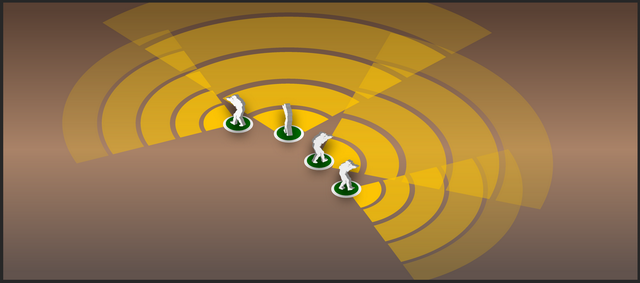
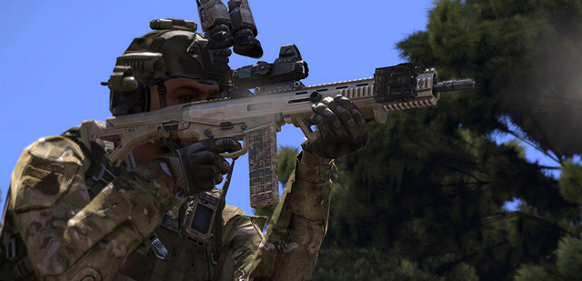
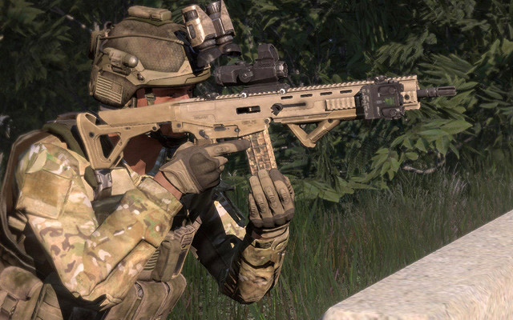
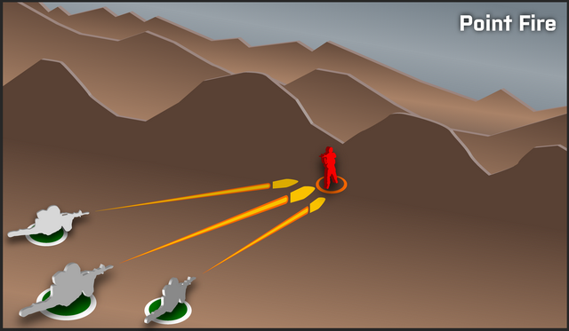
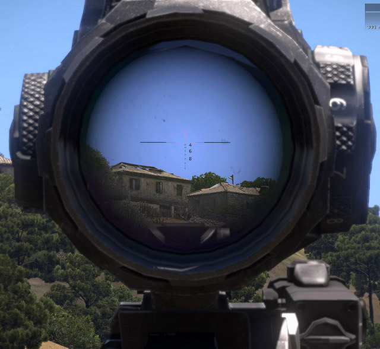
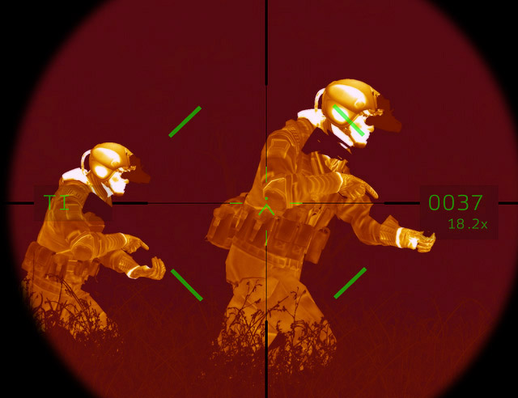

# Базові навики піхотинця

## The Basic Rifleman

As a rifleman, you are the most fundamental element of our combat power. The proficiency you demonstrate is a key factor in the survival of yourself, your fireteam, your squad, and ultimately the entire platoon. Every person plays a role in the bigger picture, and we are only as strong as our weakest link. Our aim is to make even our weakest link into a skilled player.

To this end, every player must be proficient and familiar with the role of a basic rifleman first and foremost. While you may want to fly planes and helos or drive tanks, it is important that you build upon a strong foundation of basic rifleman skills and are intimately familiar with "life as an Arma 3 infantryman" if you hope to effectively use such vehicles in the future. All vehicles are oriented around supporting the infantry, and the only way you can be truly effective at this is to know what it's like to be an infantryman to begin with.

To help you fulfill your role and contribute to the success of our missions, we'll now cover the "Basic Rifleman Skills & Knowledge". This should give you a solid baseline of knowledge that will keep you alive long enough to learn the finer points through virtual combat experience.

## Fireteams

### About the Fireteam & Your Role In It

Fireteams are the most fundamental combat elements of our platoon structure. You will learn much more about them (and everything else about our structure) in the "Platoon" section later on - for now, we will cover the basic premise behind them.

Each fireteam consists of six players: a leader and five subordinates. As a new player, you will end up acting as a rifleman in one of the six different fireteams in our standard platoon. As the rifleman, you will be under charge of a more experienced player, acting as the fireteam leader. He, in turn, will be under the command of a squad leader who leads the two fireteams that make up each squad. Likewise, the squad leader will be under the command of the Platoon Commander, who commands the three squads that form the platoon - who is in turn led by the Company Commander, who directs the movements of the platoons.

### Working as a Team

The key aspect of our organization is that of closely-knit teams - a rifleman by themself is not nearly as useful as a group of six players working as one cohesive unit. Fireteams look out for their own members as well as those of their fellow fireteams. Fireteams are the tip of the infantry spear.

Note that there are no "set" fireteams in ShackTac, nor should you expect them on most public Arma servers. You will find yourself grouped with different players in different missions, and your comprehension of this guide is what will allow you to all act as a cohesive and combat-effective group, regardless of who exactly is in your fireteam.

### Basic Responsibilities of a Fireteam Member

In order to play at the highest possible level of coordination, teamwork, and effectiveness, there are many things that each player must be familiar with. This entire guide is an example of those sorts of topics. The key foundational aspects of this are in the "basic responsibilities" of each fireteam member, and by association, every player in the platoon or company. In order to maintain cohesion and combat effectiveness, every player in our community is expected to abide by these simple ground rules.

#### As a fireteam member, you must...

- **Know your squad and fireteam.** With our structure, squads are lettered and fireteams numbered. Remember what team and squad you are in, as this allows you to pick out, confirm, and act upon voice orders relevant to you. Make sure you are familiar with your fireteam leader's voice, as well as that of your buddy team member(s). You can find out what group/team you are in via the map screen - the top-right will list your current group.
- **Listen to your team leader and follow their directions.** Fireteam and Squad Leaders are typically the more experienced players. Their role is to try to keep you alive and in the fight, while accomplishing whatever mission the squad may be tasked with. Listen to them and stick with your team.
- **Practice fire discipline and know the Rules Of Engagement (ROE), described in detail shortly.** Do not be the one to give away a stealthy approach by accidentally firing your rifle or firing at a target without having been given clearance. Once things heat up, and the element of surprise is lost, you're usually free to shoot at anything that poses a threat. Until then, maintain good fire discipline, in accordance with the instructions of your element leader.
- **Maintain appropriate interval.** Bunching up gets people killed. Keep several meters of distance between yourself and other players at all times. If not, a grenade, rocket, or machinegun is going to have a fun time with you and those you have clustered with.

- **Maintain situational awareness, avoid tunnel vision, and know where friendly forces are.** This all helps to prevent being surprised by enemy contacts, prevents friendly-fire incidents, and gives you an idea of what areas may need more observation based upon how the squad or platoon is oriented. More on this in the "Situational Awareness" section, later.
- **Cover your sector.** 360° security is needed at all times. This means that with a fireteam of six, every person should be observing or covering a different area. Good security means that your team is that much less likely to be surprised by the enemy, and thus is going to survive longer in combat. When halted, ensure that somebody is paying attention to rear security as well. If nobody else is, take it upon yourself to do so - your team will thank you later.
- **Scan for, spot, and call out enemy contacts.** Do it concisely via voice so that everyone can hear you. When giving the direction of contacts, relative directions (front, left, rear, right) can be used when friendly forces are moving in a known direction and front, rear, right, left are known to everyone. Otherwise, compass directions and degree bearings should be used. More on this in the "Contact Report" section later on.
- **Know your target.** Don't wildly shoot at everything that moves, as that tends to cause friendly fire casualties. If in doubt, don't shoot. Ask someone else in your fireteam to check out the questionable contact. Check the map to see if friendly forces are where you're looking. If you're still unsure, ask the element leader and they can take it up the chain of command if necessary. Once you pull the trigger, there's nothing you can do to bring that round back. Don't be the one to shoot a friendly through carelessness!
- **Be concise on comms.** Learn how to speak with brevity on voice channels to avoid cluttering them up when they're most needed.
- **Avoid crossing lines and lanes of fire.** If you need to move past a person, always try to pass behind them. If you ever do need to move in front of someone in a combat situation, ensure that you call them by name and tell them that you're about to cross their line of fire. Obviously common sense will dictate when this is necessary. Crossing in front of someone during general movement towards an objective is not a huge deal and does not merit a call, whereas running in front of someone during a firefight can get you killed and requires coordination with whoever you need to cross in front of.

- **Always work as part of a buddy team.** More info in the "Buddy Team" section next.

All of these topics are covered in more depth throughout this guide, so if you're not 100% sure on any of them, all should be explained by the time you're through with this.

## Buddy Teams

The buddy team concept ensures that every person has at least one other person looking out for them at all times. It simply means that you always move with, watch out for, and fight with at least one other person at your side. Buddy teams are standardized in the platoon, though fireteam leads can choose to change the groupings as the situation dictates.

The standard buddy teams are set up as follows: the Fireteam Leader is by themself, while the first two members of the fireteam - typically the Automatic Rifleman and Assistant (known as the AR/AAR pair) - are grouped together. The last three members - either another AR/AAR pair, or three riflemen or riflemen AT - are the second buddy team. The fireteam leader is generally treated as if a member of the AR/AAR buddy team, though the requirements of their leadership often mean that they're having to move between the two buddy teams to check lanes of fire and similar.

The first buddy team - AR/AAR combo - is usually the heavier-hitting of the two, due to them employing the fireteam's automatic rifle. The Fireteam Leader will keep them nearby and assign them positions and sectors of fire as the fighting develops. The second team may or may not have an automatic rifle, and is typically where you as a newer player will find yourself.

Note that if you are using the [ShackTac Fireteam HUD](http://dslyecxi.com/shacktac-fireteam-hud-for-arma-3/), and the Fireteam Leader is using it properly, you will see the buddy teams given color-codes such that they easily stick out on the HUD. More on this later in the Fireteam section.

#### Your basic responsibilities to your buddy teammate(s) are...

- **Stick with your buddies.** When they move, you should be with them. Together you are far more effective than apart.

- **Communicate with your buddies.** If it's important, let them know. If you're moving, say so, so that they can know to cover you. Good communication keeps everyone working together and aware of each other's status.
- **Cover your buddies. Cue off of your buddy's movement, sector of observation, and so forth.** If they're watching one way, cover the other. If they're going to cross a danger area (such as a street), cover them as they move.
- **Maintain accountability of your buddy.** When you change positions, make sure they come with you - leaving a wounded buddy behind in haste is an unpleasant realization to have.
- **Pull your buddy out of the fight if they go down.** If you are incapacitated, you can count on your buddy to come to your aid. Likewise, if your buddy is incapacitated, you know to step forward and do your part to save them, or contribute towards someone else, such as the medic, saving them. This may entail dragging them out of a danger area, carrying them to a medic, using smoke to conceal their position, or simply killing whoever tried to kill them. **Remember that you are no good to them dead** - if the tactical situation does not allow you to immediately help them, your task is to help make the situation more favorable - typically accomplished by killing the enemy, or coordinating with others to help kill or suppress the enemy. If your buddy is hit, a rapid assessment must be made as to whether they are dead or wounded, and whether the situation allows for you to safely pull them to cover. A dead teammate can wait, whereas a wounded one may need immediate attention from a medic and your action may be the deciding factor between life and death. If your buddy goes down, call out to the other fireteam buddy team and get them to cover you while you drag them to safety. Once you've made it to cover, call out to the squad medic and ensure that your buddy is treated. Depending on the tactical situation, you may want to stay to provide security for the medic, or move back to the fireteam and continue fighting.

Living by these guidelines is a key factor of success in battle. Learn them, know them, and be sure to always practice them.

## Situational Awareness

One of the most fundamental combat survival skills is that of situational awareness. This simply means that you are alert to your surrounding environment and can leverage your knowledge of the battlefield's state to make tactical decisions and judgment calls.

**Maintaining good situational awareness is key to preventing friendly casualties.** Proper situational awareness will allow you to spot the enemy before they spot you, detect an ambush before it is sprung, and notice unusual characteristics of the environment that may betray the presence of mines, booby traps, enemy vehicles, fortifications, and more. **It is the responsibility of every member of the unit to maintain a high state of situational awareness at all times.**

To develop and maintain that situational awareness, heed the following.

### Basic Situational Awareness Guidelines

- **Whether you're moving or halted, you should always be scanning for the enemy.** Murphy's Laws of Combat tell you that the moment you let your guard down and stop scanning is the moment the enemy will appear.
- **Cover whatever areas you have been assigned to, or cover whatever area seems to need coverage.** Adapt to the situation as needed, and be able to pick out areas that may be more dangerous, and warrant more observation, than others.
- **When you're halted, take a knee, find cover if possible, and continue to scan.**
- **Stay alert! There is no "safe" time in a combat zone.** If you let your guard down, either you will die from it, or, worse, you will get a teammate killed because of it. Getting yourself shot is one thing, but getting a teammate shot is something else best avoided.
- **Be aware of the risks of "tunnel vision", and avoid falling into that state.** Tunnel vision occurs when a player gets so fixated on a specific target, object, or area that they neglect to stay aware of the "big picture". Remember that for every enemy you see, there are probably three or four (or more) others that you do not. Fixating on a single enemy at the expense of everything else is likely to get you flanked and killed. Stay alert and aware, and you will greatly increase your odds of survival.
- **Check the map frequently to maintain awareness of friendly positions, suspected enemy locations, and more.** The map can be used to mark enemy contacts as well as friendly positions, and some mission types (or mods) allow you to see friendly forces on the map. Ensure that you check it frequently to keep up-to-date on suspected enemy positions, as well as friendly positions.

The rest of this section will detail additional situational awareness considerations, tips, and guidelines that should help give you the best chance of surviving your virtual combat experiences.

### What to Stay Aware of, Look and Listen For

There are many things that a player must stay aware of (and be on the lookout for) during the course of a mission. Depending on whether combat is ongoing or not, your may find yourself focusing on different aspects of your situational awareness. In light of that, these guidelines are broken down into general, pre-combat, combat, and post-combat tips.

#### General Situational Awareness
Keep these in mind at all times, regardless of whether combat is actively occurring or not.

- **Where are friendly forces located?** Knowing this will help you to pick which areas to spend your time observing, and will help to prevent friendly fire. This includes knowing where your own fireteam members are, where your squad's fireteams are, as well as where other squads in the platoon are located.
- **Where is the enemy most likely relative to you? What are the likely positions they will be occupying?** What can you do to minimize your exposure to them?
- **Where is the nearest usable piece of cover or concealment?** This is important to know if you come under fire unexpectedly, or make visual contact with the enemy and must enact a hasty ambush.
- **Where are my teammates watching?** Knowing where friendly units are looking helps you to pick a direction to watch that will complement their observation sectors.

#### Prior to combat, scan the following...

Pay particular attention to these whenever there is the likely threat of enemy contact. If you paid attention earlier, you should be thinking, "but you said to always expect contact, shouldn't I pay attention to these items at all times?" To which I would say yes, you are correct!

- **Bases of trees.** Tree trunks are the most prolific cover available in the great outdoors, and many enemy ambushes will involve soldiers using trees as cover and concealment.
- **Shrubs and bushes, particularly on the edges. Shooting through a bush or from within one isn't always that easy. You'll often find people firing around the sides of a bush.
- **Large rocks, boulders, stone fences, and fallen trees.** All of these provide nice hard cover and tend to attract people to them due to their protective attributes. Note that trees knocked down mid-mission will not provide cover, but those that are placed as part of the environment will.
- **Rooftops, especially near any protrusions such as stairwells.** Protruding stairwells, air vents, etc can be used as cover for anyone using a roof as a firing position.
- **The edges of windows.** You'll hopefully spot anyone blatantly standing in a window, so that means that you should focus your attention on scanning the edges to ensure that no one is 'tucked-in' to the window.
- **The edges of walls, buildings, etc.** Hard cover (such as walls and buildings) is of great appeal to an infantryman, and because of that, it should be given appropriate attention.
- **Knocked-down trees, bushes, fences, etc.** If the enemy has vehicles they may accidentally run down trees, bushes, or other obstacles and give away where they've been. The enemy may also knock down trees and then use them as concealment, or to clear fields of fire when in the defense.
Prominent structures. Snipers, machinegunners, and forward observers tend to head into tall structures when they have an opportunity to do so. Being aware of these structures, and scanning them accordingly, will help to avoid nasty surprises.

#### In combat, look for...

Once contact has been made and fire is being exchanged, start paying attention to these aspects.

- **Muzzle flashes at night, and muzzle smoke during the day.** You may not always see the precise outline of an enemy, but that big puff of smoke and dust in the day or flash of flame at night (or in low light situations) that keeps popping up from the same location over and over again can act as a great indicator to where the enemy is located.
- **Tracers.** Tracers are brilliant neon signs that say "I'm firing from over here!" These are the most visible signs of the enemy, and the easiest to follow back to the shooter's origin. Note that not all weapons will fire tracers.
- **Smoke.** If the enemy fires a heavy weapon such as a rocket propelled grenade (RPG), you'll be able to pick out their position by the large volume of smoke produced by the weapon's backblast. You may also see the enemy using smokescreens to mask their movement. Typically, a cloud of smoke created in such a fashion is a giant "Shoot here!" sign, since it's most likely being used to conceal the enemy's movement. However, keep in mind that the enemy may sometimes employ smoke as a diversion.
- **Dead enemies.** This is particularly useful if contact was made with the enemy by another element, close air support, or artillery. Dead enemy soldiers can give you an idea of where the enemy was, what they were (e.g. special forces, normal troops, etc) and even where they may still be.

#### After combat, look for...

Whether the enemy has fled or been defeated, or after coming upon the scene of dead enemies, keep an eye out for the following.

- **Stragglers or last-stand enemies.** Just because you think you killed them all, doesn't mean that you killed them all. Stay ever-vigilant and check any area where a lone survivor might try to hide to ambush you and your teammates. Clear the area before you start checking bodies.
- **Incapacitated enemies.** In mods with more robust damage simulation, you may come upon enemies who have been knocked unconscious or have passed out from damage. Never assume that a downed person is dead, always check them to be sure.
- **Watch for satchel charges or other explosives that could have been set on a timer or may be command-detonated.** If you see any, immediately announce it to your element leader and vacate the area. Satchel charges can be hidden in grass and can be very hard to pick out. Keep good interval when clearing enemy bodies to avoid a hidden satchel causing multiple casualties. If possible, avoid sending more than one or two people to check out enemy bodies to begin with.
- **Check what weapon systems have been left behind if the enemy retreated.** If they abandoned valuable weapons like RPGs, anti-aircraft missiles, machineguns, crew-served weapons, etc, they are potentially disorganized and a decision can be made as to whether the fleeing enemies should be pursued.

#### Listen!

A sharp ear is often as valuable as a sharp eye, and there are several things you will want to listen for at all times such as the sounds of combat, vehicles, movement, and voices.

- **Sounds of combat.** This is the most obvious sign. If you hear firing, figure out what direction it's coming from and alert your teammates if they haven't already noticed it. Occasionally you will run into inexperienced enemy players negligently discharging their firearms (typically because their finger twitched and they weren't observing the "middle mouse safety" rule, detailed later); this can be used to determine where enemies are, even if they're out of direct visual observation. The more experienced you are, the more likely you'll be able to distinguish the different types of rifle fire from a distance.
- **Sounds of vehicles.** Being able to hear a vehicle from a distance, as well as identify the class by the sound it makes (such as being able to distinguish the noise of tracks from wheels, or rotors from jet engines) can help to prevent surprise and maintain initiative.
- **Sounds of movement.** Soldiers make noise as they move around the battlefield, so listen for it. The sound of boots on gravel, uniforms brushing against trees, the thumping and rustling of someone running through underbrush, or anything else that catches the ear. Particularly in dense terrain, this may be the only sign you have that the enemy is there before you run smack into them.
- **Voices.** Know who your teammates are, and know their voices. If you hear someone you don't recognize, it could quite possibly be the enemy. If you know you're in enemy territory, stay particularly alert for any unknown voices, and use any that you hear to help guide you towards the enemy and deal some damage to them. Bear in mind too that the enemy may be crafty and attempt to lure players into an ambush by having one person speak loudly while others wait in ambush.

## Identifying Friend or Foe ("IFF")

Being able to visually differentiate between friends and foes is a critical skill to have, one which requires some practice to attain. It is important to be proficient at IFF, as someone who cannot tell the difference between their faction's uniforms and gear, and those of the enemy, is a danger to their entire team.

There are several basic guidelines that can be followed to help prevent friendly fire incidents.

### Guidelines to Prevent Friendly Fire

- **Keep your finger off the trigger.** Keeping your "firing"' finger rested on your middle mouse button, instead of the fire button, helps to prevent an accidental and potentially fatal shot at the worst possible time - this is described in a bit more detail later.
- **Think before you pull the trigger and establish positive identification ("PID") before firing.** Use your head before your rifle. If it doesn't feel right, if something seems "off" or amiss, hold fire. If it looks like a friend, has a friendly weapon, isn't shooting at you, but seems like it's in an enemy area, it may be a friend, and you can't risk taking a shot without being sure.
- **If in doubt, don't fire.** Ask a teammate or your team leader to check out a suspected enemy if necessary. People with optics (such as rifle scopes, binoculars, etc) can be great help in identifying potential enemies.
- **Stay alert as to where friendly forces are located, and communicate your location to others when appropriate.**
- **The colors of tracers and the sounds of the weapons being used can help to identify the enemy,** but bear in mind that over the course of a mission friendly forces may acquire enemy weapons and thus it becomes less and less accurate as a mission progresses. Also, intelligent enemies may acquire friendly weapons from casualties and use them in the hopes that they will sow confusion amongst their enemies.

### Arma 3 Faction Familiarization

Arma 3 consists of five major factions - NATO, CSAT, AAF, FIA, and civilians. NATO comprises BLUFOR ("good guys"), CSAT OPFOR ("bad guys"), AAF is independent, FIA are guerrillas, and civilians are... civilians.

TABBBBBBBBLE HERE

More information about the factions can be found on [the official Arma 3 site, here](http://www.arma3.com/features/factions).

The important aspects of the factions, in our terms, are what they look like. A personnel identification guide and basic vehicle guide follow this section.

### Personnel Identification

The following pictures show a variety of unit types for each of the main factions. From left to right, the roles depicted are:

- Rifleman, Vehicle Crewman, Helicopter Pilot, Jet Pilot, Sniper, Diver

It is important that players are familiar with the different uniforms of the various factions - some of them are pretty close to each other, and can easily be confused in the heat of a fight if one isn't very familiar with the distinguishing features.

#### BLUFOR

#### OPFOR

#### Independent

### Basic Vehicle Identification

#### BLUFOR

BLUFOR vehicles are typically identified by their flat dark earth paint - though some aircraft use green or dazzle patterns.

#### OPFOR

OPFOR vehicles tend to follow the hex-patterned camo theme, with flat tans, reds, and olive colors throughout.

#### Independent

Independent vehicles use a digital pattern consisting primarily of green and tan, making them stand out distinctly from the other factions.

## Basic Movement Techniques

### Guidelines for Movement

How an individual moves around the battlefield is the most important aspect of not being shot. Proper movement will keep you alive, whereas sloppy movement tends to result in a lot of unnecessary pain and suffering once the enemy has a chance to contest it. The following guidelines should serve you well if you heed them.

- **Move from cover to cover, or concealment to concealment.** If you're under fire, do so in short rushes. Ensure that you know where you're going next before you start to move from your current position. This helps you avoid getting caught out in the open without a plan.
- **Maintain good interval. Bunching up gets people killed.** Try to keep at least five meters between yourself and any other players whenever possible. Ten meters is even better. Doing this will help to minimize the impact of enemy artillery, grenades, mines, other explosives, and the initial burst of fire from a surprise contact. If you're using the ShackTac Fireteam HUD, a teammate that is too close to you will highlight orange to warn you to maintain your spacing.

_CASUALTY PATTERNS FOR MODERATE AND TIGHT GROUPING, SHOWING HOW SPREADING OUT CAN HELP TO PREVENT MASS CASUALTIES FROM EXPLOSIONS._

- **Conserve your stamina.** If the situation isn't urgent, avoid sprinting. There is a tendency for players to sprint all over the place, regardless of the tactical situation. Inevitably this ends up getting people killed, since they tend to run into enemies after an extended sprint and thus cannot effectively aim due to the incurred stamina penalties. Everyone should work on reserving their stamina for situations where it is desperately needed, such as an ambush, sniper fire, or any other time when getting out of the danger area takes priority over everything else. Plan for the need to take a rest every so often - jogging can be done for a period of time, but will eventually fatigue you, while sprinting will rapidly fatigue you, and moving up steep hills compounds their effects further. The more fatigued you are, the more your vision will be distorted, the louder you'll breathe, the less stable your aim will be, and the slower you'll move. When given the choice, jog or walk when possible and take "stamina breaks" when the opportunity presents itself. Not only will you live longer, but it'll make it that much easier for your team to maintain decent interval and coverage of each other while moving towards enemy contact.

- **Know where to go when contact is made.** If you stay aware of your environment, you should be able to instantly move towards cover or concealment if your team encounters unexpected contact. The last place you want to be standing is the place you are at when contact is made - if it's an ambush, someone is probably either already aiming at you, or trying to get you in their sights. Move with speed and intensity to a better position and then begin aggressively fighting back.

- **Take a knee at halts.** Kneeling or crouching lowers your exposure, which makes it harder for someone to hit you from a distance. Get into the habit of taking a knee any time that you're halted for more than a second or two. If you expect to be stationary for a longer period of time, you may want to go prone, find better cover or concealment, or both.

_TAKING A KNEE WHEN HALTED_

- **I'm up, they see me, I'm down.** The basic "individual rush" consists of jumping up, sprinting forward a bit, and then diving prone. Throwing in a roll after hitting the deck will help to throw off the enemy's aim, and will be very effective if you're rolling in tall grass or with concealment nearby. When doing a proper individual rush, the enemy will only have a few moments to see you, sight in on you, and attempt to shoot you. The "diving prone" at the end of each rush can also help to confuse the enemy as to whether they shot you or not. Having a fireteam moving via individual rushes presents many short-exposure targets that are difficult to engage, and this method can be very successful at keeping a team alive while still making headway with movement.
- **Move at a pace appropriate to the environment and known or expected threat.** Depending on the situation, you may want to sprint, run, walk, or move at the "tactical pace", which we'll get to in a moment. Walking allows you to keep your weapon up and ready to fire, and allows you to move slowly, deliberately, and with a great deal of caution. Tactical pace is similar to walking, but allows you to move significantly faster while still keeping your weapon up. Depending on the environment and tactical situation, pick the movement speed that balances your ability to maintain situational awareness and react rapidly to threats with your vulnerability as a target. In dense terrain, walking or using the tactical pace is often the answer, while in more open terrain, you may find yourself sprinting from cover to cover instead.

_MOVING WITH THE RIFLE IN THE READY POSITION_

- **Use shadows for concealment at night, but only when in close proximity to the enemy.** Shadows, combined with very slow and deliberate movement can make it hard to spot someone. However, be warned that this effect relies on two things: one, that the enemy is close enough to you that they see shadows the same place that you see them, and two, that the enemy has shadows enabled on their system. If either of those are not true, shadows won't help you at all. It's a gamble at times, but as long as you assume that the enemy may still see you, you can minimize the risks. Read more about this in the "Fighting at Night" section later. Many communities will enforce standards for shadow usage, and violators can expect to be banned from future participation. If you're looking for good nighttime combat, search for communities that enforce it properly.
- **Don't skyline yourself.** Skylining is silhouetting yourself against the sky. This can happen when walking on the top of a piece of terrain that is higher in elevation than the enemy. If you absolutely must cross a ridge and think the enemy might be looking that way, go prone and try to cross the ridge where vegetation provides some amount of concealment.

_THE ENEMY SKYLINING THEMSELVES AT DUSK_

### Stamina & Load Management

Arma 3 refines stamina into a more significant gameplay factor than in prior games. As in reality, the individual infantryman can only carry so much and still remain capable of sustained action.

Tactically, the stamina changes in Arma 3 help to emphasize the role of terrain and proper combat loads in a battle. Hills and other inclines cause greater fatigue, and fast movement paces like tactical pace and sprinting cannot be maintained indefinitely. Heavy gear is likewise fatiguing to carry, and players must move intelligently with consideration paid to their load and stamina. These changes bring the pace of the battle much closer to realistic levels, and also help to prevent people from attempting to carry an arsenal more appropriate for a game like Doom on their backs.

As you fatigue in Arma 3, you'll find yourself gradually slowing down, with actions such as stance changes being influenced by high levels of fatigue. The heavier your gear and pack are, the quicker you'll fatigue. Severe fatigue is indicated by heavy breathing combined with the screen edges pulsing and the whole view blurring periodically. Recovery is brought about by moving more slowly, or stopping entirely. Keep in mind that any movement speed faster than a walk will add fatigue over time - the faster, the quicker it will happen. Moving while prone is particularly fatiguing, as is sprinting.

Dealing with stamina is best done in a few different ways.

#### Tips on Dealing with Stamina

- **Monitor your encumbrance.** You can see your current encumbrance. level in the inventory screen, at the bottom of the window. Try to keep this such that there's a comfortable gap between your current load and the maximum load. The lighter you are, the less interruption you'll have to deal with from fatigue and resting.
- **Take reasonable combat loads.** A basic fighting load should include around ten magazines, a rifle, first aid kit, and some fragmentation grenades. This leaves you room to pack a bit extra as well without becoming unnecessarily overburdened. For instance, an assistant automatic rifleman will be able to carry additional boxes of ammo for the automatic rifleman, while an anti-tank gunner can carry a launcher.
- **Sprinting everywhere is not the answer.** It is easy to fatigue yourself unnecessarily by trying to sustain a high pace of movement for too great a period of time. Move around at a jog or a walk, and reserve your energy for times when you will badly need it.
- **Take a moment to rest between significant moves, during long sustained tactical movements, or before moving across a danger area.** It only takes a short period of resting (preferably while crouched or prone) to regain your stamina. Resting briefly at tactically appropriate times ensures that you maintain a reserve of stamina, which will come into great importance when contact is made. Resting also gives you an opportunity to more thoroughly scan your surroundings and increase your situational awareness.
- **Many crew-served teams and other attachments (described on the "Attachments" chapter later) carry gear that is significantly heavier than an average infantry fighting load.** Heavy anti-tank team gunners, anti-air gunners, medium or heavy machinegun teams, and others fall into this category. When acting as one of these roles, you will need to pace yourself. Recognize that carrying hundreds of pounds of gear, to include your helmet, vest, armor plates, ruck, rifle, ammo, frags, and whatever special weapon you may be responsible for (along with its ammo), will slow you down.
- **Spread-load supplies.** Whenever possible, special supplies like mortar rounds, anti-tank rounds, machinegun ammo, etc, should be spread out amongst many people, either within a gun crew, or distributed in general throughout the platoon.

Leaders must also keep in mind the stamina and load aspects of combat and movement in their planning. For instance, having an attacking force end up heavily fatigued before making it into fighting range is to be avoided.

## Cover & Concealment

_A RIFLEMAN CREEPS AROUND THE CORNER OF A ROCK TO SCAN THE AREA FROM A LOW-PROFILE POSITION_

### Cover vs Concealment

The first rule of "not being shot" is ensuring that the enemy either cannot see you or cannot hit you, or both.

You will find that one of your primary goals on the battlefield is to locate positions from which you have the most protection from enemy fire or observation yet also are able to put effective fires on the enemy. To do this, you will have to know the difference between cover and concealment and how to best take advantage of both. **You should strive to always be in cover or concealment when combat is occurring.** If the enemy cannot visually locate you, they will not be able to accurately shoot at you. Even if they do know where you are, hard cover can prevent them from effectively engaging you.

**Concealment is anything that keeps the enemy from seeing you.** Typically this comes in the form of brush, bushes, thin sheet metal or wood, and other materials that are easily penetrated by bullets.

_A MACHINEGUNNER POSITIONED IN SOME CONCEALING BUSHES. WHILE THEY WON'T STOP A BULLET, THEY MAY PREVENT THE ENEMY FROM SEEING THEM IN THE FIRST PLACE._

**Cover on the other hand is anything that keeps the enemy from hitting you with their fire.** Anything solid enough to stop a bullet works, this includes tree trunks, brick walls, vehicle hulks, etc. Bear in mind that cover is only effective relative to what is being fired at you. While a brick wall might protect you from machinegun fire, an RPG or tank HEAT round will make a mess of you in short order.

_A RIFLEMAN USES A ROCK OUTCROP AS COVER VIA STANCE ADJUSTMENT_

### Tucking into Cover & Sight Displacement

One critical thing to remember in Arma is that the view you get from ironsight mode is offset down and to the right of your normal view. If you take this into consideration when utilizing cover, you can expose much less of your body.

_USING A TREE PROPERLY FOR COVER_

While the above illustration uses a tree as the example, the same principle can be applied to any kind of cover - lamp posts, large rocks, vehicles - and can significantly improve your odds of survival.

### Stance Adjustment System

One of the most significant additions for Arma 3's infantry combat is the introduction of a stance adjustment system. The basic standing, crouching, and prone states are fleshed out with high and low adjustment states for each, leading to a total of nine different vertical stances, as well as "step leans" for crouched and standing states, and sideways prone adjusts when prone.

Utilizing the stance options allows for you to match your stance to the cover or concealment available, minimizing your exposure to enemy observation and fire. Try to only peek up as much as necessary to see or shoot. The smaller of a target you present to the enemy, the less likely they'll see you or be able to hit you.

### Leaning

Arma 3 has two styles of leans. There's an upper-torso lean, which allows you to shoot around cover while keeping a large amount of your body protected from fire, and there are step-leans which allow your character to shift left or right more fully. Step-leans and upper-torso leaning can be combined for an even greater range of motion as well.

The fact that you can utilize the upper-torso leaning and move at the same time can be quite useful, as it allows you to position yourself exactly how you'd like in the least amount of time possible. Usage of a TrackIR (or rudder pedals) enables you to do an incremental upper-torso lean, which allows you to tailor exactly how much you're leaning at any given time. This can be useful when stealth is a concern, as well as when you want to expose as little of your body as possible to enemy fire.

_INCREMENTAL LEANING (LEFT), STEP-LEANING (RIGHT)_

Remember that peeking in and out from cover will be less effective against human players - if you keep peeking out from the same position, with the same stance, the enemy may predict your pattern and have a bullet waiting for you next time you pop out. Try to alternate your vertical stance when possible, or find another position to fire from if you think they're starting to zero in on you.

Note that a left step-lean will result in your character shifting the rifle from your right shoulder to your left. This can be used to expose less of your body when firing around the left side of an obstacle when standing or crouched.

When prone, adjusting your stance left or right will allow you to lay on your side and scoot back and forth. This gives you an easy way to edge around cover without exposing too much of your body in the process.

### Accuracy & Exposure by Stance

The level of accuracy that you are able to achieve with your weapon is based in part upon the stance you take. Standing is the least stable, with crouched being more stable, and prone being the most stable.

**You should get in the habit of taking a knee whenever firing at medium or long ranges, and even closer ranges if the situation permits.** The benefit of taking a knee is twofold: one, you increase your accuracy, and two, you decrease your profile. The smaller you make yourself, the harder it is for the enemy to hit you.

When it comes to firing on the move, you can do it either when standing or crouched. Standing is the most stable in this case, whereas crouching and moving while trying to aim will tend to tire you out fast and increase your weapon sway due to the lowered stamina. Arma 3's new "tactical pace" movement option allows you to keep your weapon up while moving quickly, while you can use your walk key to move at a slower pace when the situation requires it. Tactical pace allows infantry to assault rapidly towards a location without sacrificing their ability to fire at a moment's notice - though their accuracy is lowered due to the speed of their movement.

_ADVANCING IN THE TACTICAL PACE, WEAPON AT THE READY_

