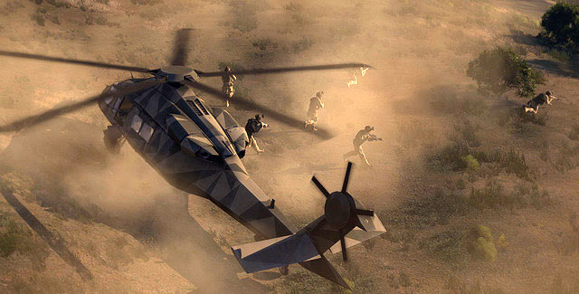
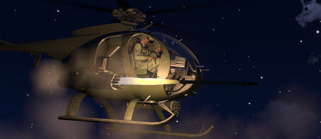
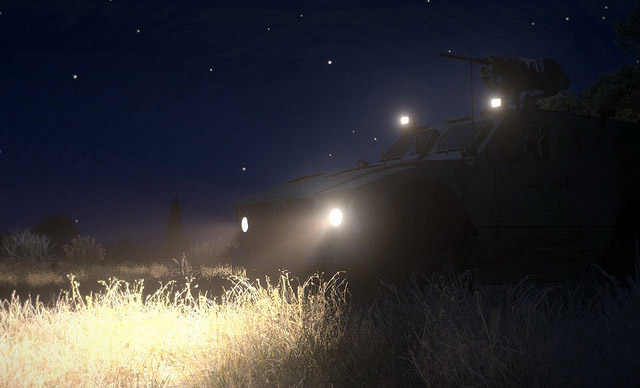
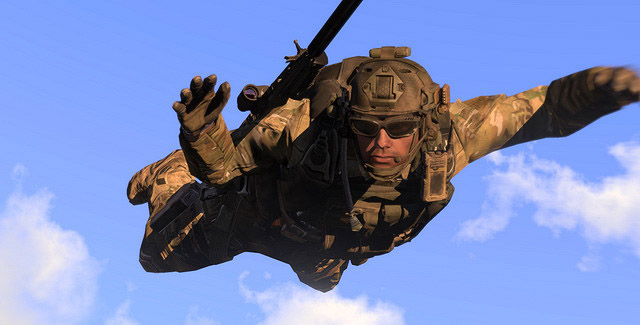
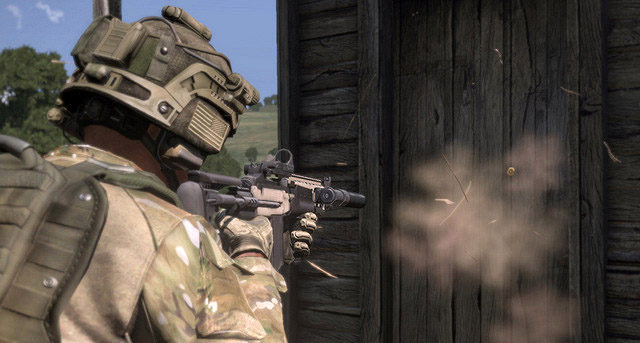
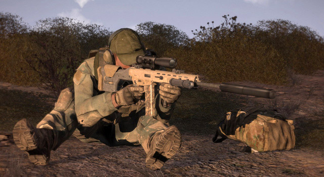
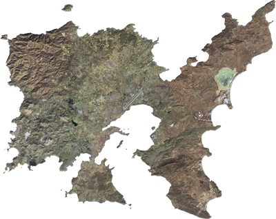

# Вступ

## Ласкаво просимо!

Ласкаво просимо до Arma 3 **"Посібника з Тактики, Технологій і Процедур (Tactics, Techniques, and Procedures Guide)"**, розроблений для [Shack Tactical](http://www.shacktac.com/), перекладений українською для [ArmA 3 Ukraine](https://discord.gg/CfuqprQw) і опублікований в співпраці з [Bohemia Interactive](https://www.bohemia.net). Я хотів би спершу поговорити про цей посібник, про те, як він з’явився, що відрізняється між ним та моїми попередніми посібниками для серії ігор Arma, а також про всілякі інші теми преамбули. Я вважаю, що є кілька важливих речей, які потрібно розповісти, перш ніж ми зануримось у посібник.

### Намір

Вітаю! Мене звуть Ендрю Глюк (Andrew Gluck), хоча ви, швидше за все, знаєте мене по моєму інтернет-ніку Dslyecxi. Я засновник спільноти Arma Shack Tactical, спільноти, яка послужила натхненням для цього керівництва та кожного попереднього керівництва у серії. Протягом наших майже восьми років існування (станом на 2020 рік) Shack Tactical (скорочено ShackTac) - намагалась відповісти на питання, як найкраще підійти до гри і як сповна використати можливості Arma. З часу першої операції Flashpoint в далекому 2001 році ця серія ігор виділялася неймовірно глибокою симуляцією, яка заслуговує часу і зусиль, які ми колективно витратили на навчання, вдосконалення та насолоду.

Мої тактичні посібники створені з метою розповсюдження знань за межі ShackTac, з надією, що випрацювані нами уроки та доктрина, яку ми створили для себе, допоможуть покращити досвід гри усім, хто грає в Arma. Наявність наших путівників - які ми просто називаємо "TTP" - дозволило нам набути загального розуміння військових операцій в Arma, незалежно від того, чи був у когось із учасників військовий досвід. Завдяки цьому ми отримали фантастичний ігровий досвід протягом багатьох років, і я сподіваюся, що третя ітерація наших TTP допоможе поширити цей досвід на ще ширше коло гравців Arma 3.

Ви можете зауважити, що на відміну від моїх попередніх посібників, TTP3 є офіційним продуктом Bohemia Interactive, доступним як частина Arma 3 Deluxe Edition, а також у форматі друкованих та електронних книг. На додаток до цього, я хотів би подякувати їм за люб'язну згоду дозволити мені розмістити веб-версію ядра керівництва - близько 130 000 слів - безкоштовно. Інформація, що знаходиться в цьому документі, - це те, до чого кожен гравець Arma повинен мати доступ - вона не має бути захована на наших приватних форумах або бути платним продуктом. І це справді похвально, я дякую їм за підтримку мого бачення!

Цей посібник доступний для всіх, хто має час його прочитати, з надією, що кожен може щось взяти з нього. Сильна спільнота Arma приносить нам усім користь, і якщо цей посібник сприятиме цьому будь-яким чином, я вважатиму це великим успіхом!

Звісно, цей не єдиний спосіб. Однак ShackTac надзвичайно добре працює для нас. Сподіваємось, ви також зможете використати це керівництво у своїх іграх!

### Що змінилось?

With Arma 3, we see the series further enhanced and refined - with a particular focus on the infantry aspects of it. These changes in game mechanics, technology, and other aspect of the simulation environment were the inspiration to take the existing second iteration of my TTP guide, update it, integrate the lessons we collectively learned in Arma 2 and Operation Arrowhead, and both refine and expand the content to cover Arma 3's possibilities as well.

Since Arma 2's release in 2009, ShackTac has had over four years worth of gaming experiences to learn and grow from. We've seen some incredible changes in the series from that time - from Operation Arrowhead's release, to game-changing modifications like the [Advanced Combat Radio Environment (ACRE)](https://steamcommunity.com/sharedfiles/filedetails/?id=751965892) mod - and have adapted our own methods accordingly.

If you're familiar with my prior guide, you'll no doubt find plenty of familiar work here, updated to Arma 3 standards and refined to reflect our experiences in the intervening years. One of the biggest changes is the reorganization of our group structure. In 2009 we were platoon strength - in 2013 and beyond, we operate at the company level. Our infantry platoons have been reworked for a variety of reasons, detailed within, while we see a new set of roles emerge with our Company Commander, as well as changes to how our Platoon Commanders operate and how our attachments and crew-served weapons teams are employed.

Arma 3's infantry-centric improvements manifest themselves most strongly in the Basic Infantryman chapter, which goes into detail about the new inventory systems, weapon and gear modularity, stance adjustments, and much more. The enhancements don't stop there - each chapter has been carefully reviewed and refined, with obsolete techniques culled and new ones introduced.

For those who have purchased the full guide, you'll find an additional chapter containing several more advanced concepts - from a guide on Survival, Escape, Resistance, & Evasion, to a role breakdown of Combat Engineers, Paratroopers, and Combat Divers, as well as information on Guerrilla Warfare, Reconnaissance, and how to Fight at Night. I'm very proud of these sections, and I hope those who chip in for a Deluxe guide enjoy reading them as much as I did creating them.

All told, this guide has ended up as about 150,000 words worth of content (with the bulk of that being presented freely here), with hundreds of pictures and illustrations to further flesh it out. As before, there is no military fluff here. Every topic covered is truly relevant to the series - whether in the vanilla game or in one of countless community modifications or missions.

## Reality vs Gaming

### Milsim & pitfalls

As before, the point of this guide is to convey material that truly is relevant to Shack Tactical's style of realism-combined-with-fun combat simulation. This is the sort of information that our players use every session to work as a well-oiled and diverse team. We have maintained a very pragmatic outlook on military simulation (milsim) and have taken every measure possible to avoid doing things "because the real military does them" and thus becoming what we call "hardcore milsim".

In our eyes, hardcore milsim is chock-full of "tactical fluff" that is irrelevant to the games at hand. This hardcore milsim typically presents itself though excessive rules, regulations, attempted recreations of full military rank structures far beyond what is relevant in the scope of your average Arma mission, doing things "because the real military does them" regardless of their actual application to the game at hand, and other things that we believe do not have a place in these games.

This guide reflects that mindset as well. One thing that I noticed back before doing my first guide was that military-game guides commonly fell victim to two pitfalls - the first being the recitation of actual military publications, without any attempt to separate the wheat (info relevant to gaming) from the chaff (military or real-world procedures that are irrelevant or not simulated in games). Now, don't get me wrong - there are many things that can be learned from military publications and field manuals, and this guide benefits heavily from being referenced against a number of such manuals. However, this is not a recitation of them word-for-word, as that would be pointless. The information presented here is what is truly relevant to the game, as we have experienced through our years of gaming.

Another thing that must be kept in mind is that the kind of missions most commonly found in games like Arma - in the real world - require a massive amount of planning and preparation by well-trained professional military personnel well before the first shot is ever fired. The goal of groups like ShackTac is to be able to play to the best of our ability without requiring such huge time-sinks in the pre-mission planning. Basically, we want to get the best results we can without having to spend hours in advance planning out each operation. Planning is great, but we strive to keep the initial planning short and sweet - minutes at most - and further develop our plans as we carry out the mission. After all, as the saying goes: "No plan survives first contact".

The second pitfall is that of being "gamey". "Gamey" guides are those that are oriented around giving very precise info about things in a fashion that takes advantage of knowledge that would not exist in reality - for example, a list of tanks, their armor values, and the precise 'damage' values of anti-tank weapons. These "gamey" guides also tend to give tactics that are meant to exploit the game itself. I don't believe in those types of guides, so if that is what you're fond of, my apologies - you won't find it here.

### Fun is the Ultimate goal

Finally, it is worth reiterating that we are playing games here. The point is to have fun - in our case, we strive for organized, disciplined fun. We are not trying to pretend that we're in the military - many of us have already been there, done that, or are still there and doing that. We're in ShackTac and playing Arma to have a good time. We're a community of friends, ultimately, and this guide is written in that spirit.

### A Technical Note

The online version of this guide was developed with [Google Chrome](https://www.google.com/intl/en/chrome/browser/) and likely looks the best in it.

With that out of the way - best of luck to all of you as you delve into both this guide and Arma 3 itself!

## Intro to Arma 3

### What Arma 3 Is

For those of you new to Arma, the basic premise is that it is a military combined-arms simulation with an incredible scope and a second-to-none ability to convey large-scale modern military combat. In addition to that, it is a fantastically configurable and moddable game. It comes with a robust mission editor and scripting language, and tools are available to allow any manner of units, weapons, vehicles, terrains, etc, to be created for the game.

Arma 3 follows in the footsteps of Operation Flashpoint, Arma 1, and Arma 2 to provide the most realistic combined-arms from-the-infantry-up experience around, bar none. It is a military sandbox environment that can be tailored exactly in accordance to what you want from it.

In addition to that, Arma 3 supports a robust set of multiplayer features. It has the capability to handle up to a hundred or more players in a single mission at a time, playing against each other in teams, together against the AI in cooperative scenarios, or any imaginable mix. The mission design possibilities are almost unlimited - if you can think it up, you can probably make it.

Like the other games in the Arma series before it, Arma 3 is the game of choice for my group, Shack Tactical. The experiences we have had in these games for the past many years have been unlike anything else available in gaming, and it continues to pull players back week after week in large quantities into ever-changing and new scenarios. We play the whole range of missions, from serious to not-at-all serious, and all of it is an utter blast. It is our enthusiasm for this sort of group-wide "Build Your Own Adventure" method of content and mission creation that has allowed us to thrive as a private group for so many years.

I hope that anyone who is looking into the multiplayer facet of Arma 3 is able to find a place to play where the vast possibilities of the game can be appreciated with a quality group of players. I also hope that this guide is able to provide the base of knowledge to help players work together throughout the community, if not exactly "by the book," then at least more informed because of it.

_ALTIS, THE PRIMARY TERRAIN OF ARMA 3_

## Forward-Looking

As with the prior guides in this series, the TTP3 is written with a forward-looking mindset, intended to still be applicable years after release. Because of this, there are some references to features and concepts that may not apply to the original release version of Arma 3, but are grounded in reality and commonly encountered in modifications and scripted missions created by the larger community. Any inclusions of such features are based solely on my own personal experiences through nearly eight years of multiplayer and modding in this series, and you can reasonably expect to see everything mentioned in this guide when combining Arma 3 with additional community modifications - one of the biggest strengths of the series. My personal view is that it is better to write about things that you know will be available to a series that continually grows after each release, than to avoid the topics and deprive people of valuable techniques that will serve them well when said functionality appears. I hope you agree!

## Video Material

In addition to this guide, I run a personal Youtube channel that shows off the gameplay of my group in the Arma series, as well as instructional material on various tactical and gameplay concepts within it.

If you'd like to take a look, you can [find my channel here](http://www.youtube.com/user/Dslyecxi). An example of my Arma 3 content is below, along with links to other notable pieces.

<iframe width="640" height="400" src="https://www.youtube.com/embed/cix07R1vlhI" frameborder="0" allow="accelerometer; autoplay; clipboard-write; encrypted-media; gyroscope; picture-in-picture" allowfullscreen></iframe>

**Some of my Arma 3-specific works include:**
- The official Arma 3 'Community Guide' series, including
  - [Intro to Arma 3](http://www.youtube.com/watch?v=2XdK9xhJyH8)
  - [Basic Infantry Tips](http://www.youtube.com/watch?v=k3DyRtMkRNI)
  - [Basic Multiplayer Tips](http://www.youtube.com/watch?v=lLH7ctfTeBA)
  - [Basic Helicopters](http://www.youtube.com/watch?v=PmnLl8iEnrI)
  - [Snipers & Launchers](http://www.youtube.com/watch?v=A97iXLuxJvs)
  - [Combined Arms](http://www.youtube.com/watch?v=yfaJKpL56Qg)
- [Movement & Shooting Tutorial](http://www.youtube.com/watch?v=G8vrbzNYEwM)
- [Gear & Weapons Customization Overview](http://www.youtube.com/watch?v=yLIPW0oIvm8)
- [The ShackTac Fireteam HUD](http://www.youtube.com/watch?v=eaCw_tu8U-4)
- [Using the Rifle Combat Optic](http://www.youtube.com/watch?v=qo6qgKrIiNc)

If you're looking for even more content, check out [my recent videos](http://www.youtube.com/user/Dslyecxi/videos), as well as my [Art of Flight](http://www.youtube.com/playlist?list=PLQEd6zRLOafVn1SweJmdr-3ICqI885awY), [Video TTPs](http://www.youtube.com/playlist?list=PLQEd6zRLOafU3aek--f71a-GQwByv6_bP), and [commentary playlists](http://www.youtube.com/playlist?list=PLQEd6zRLOafWjCdqAwYoSGJQ4X4Iec-ps). If you're really keen, feel free to [subscribe to the channel](http://www.youtube.com/user/dslyecxi?sub_confirmation=1), and I hope you have as much fun viewing everything as I've had creating it!

## Moving on...

With the intro bits out of the way, let's go ahead and move into the meat of this guide!